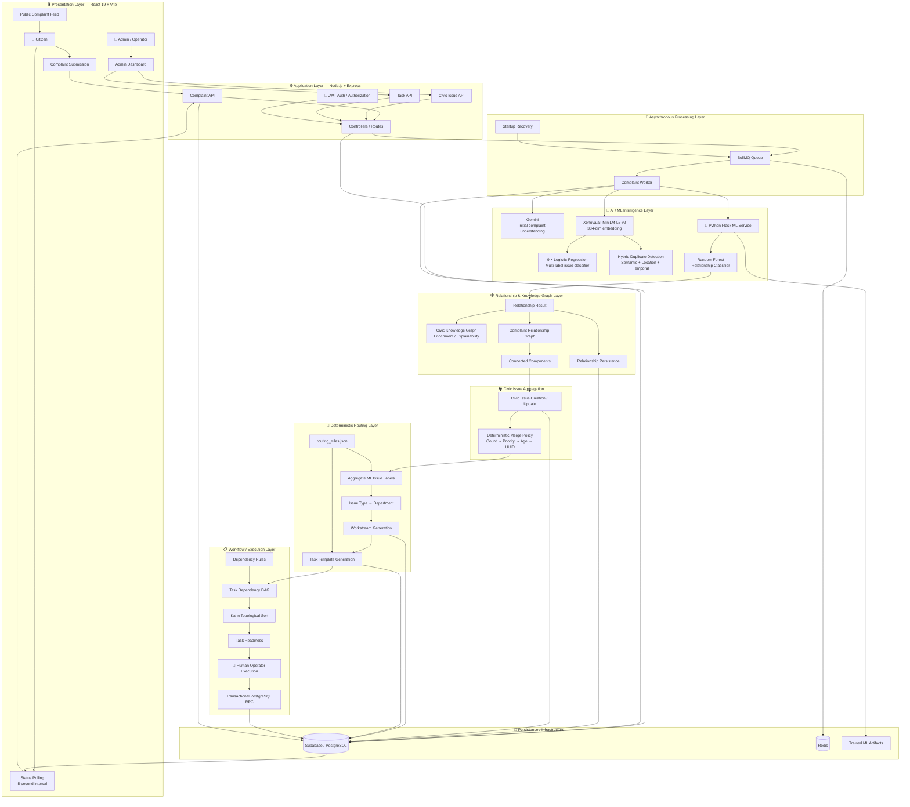
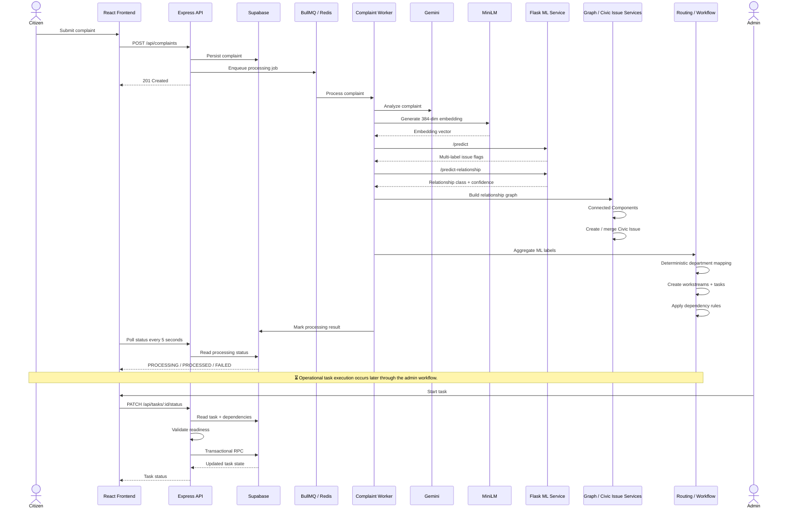
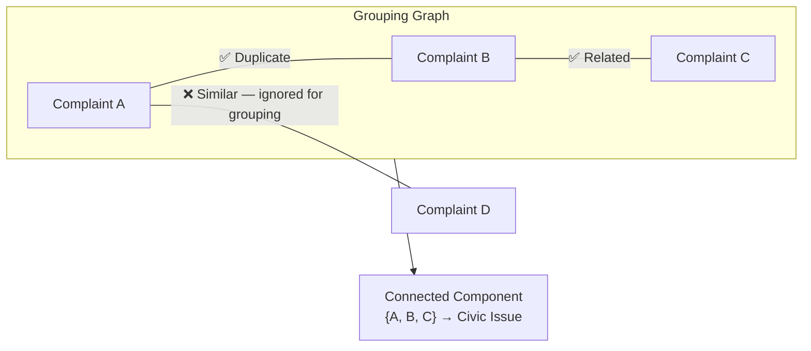
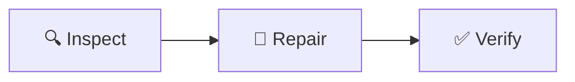
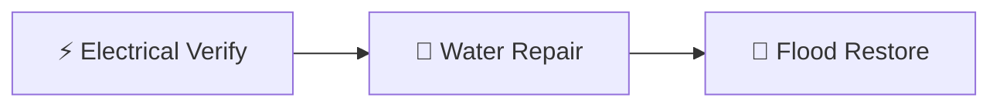
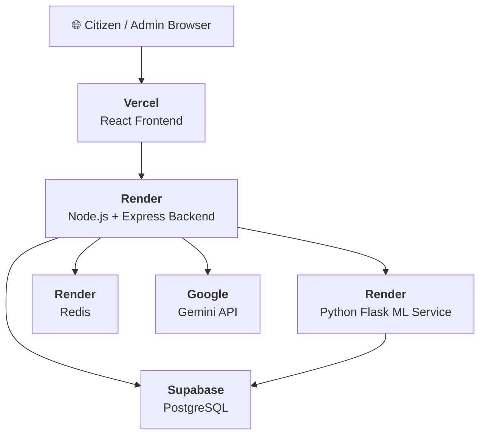
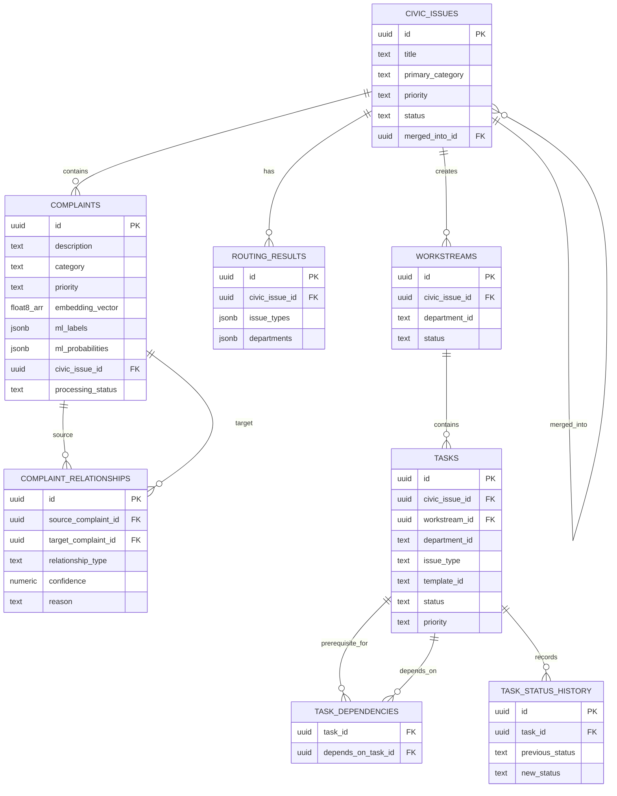

<div align="center">


<br/>

<h1 align="center" style="font-size: 3em; margin-top: 10px; font-weight: 800;">🏛️ GrievanceIQ</h1>

<p align="center" style="font-size: 1.2em; color: #667eea; font-weight: 500;">
  Transforming unstructured citizen complaints into structured Civic Issues,<br/>
  deterministic departmental workstreams, and dependency-aware municipal tasks.
</p>

<br/>

<!-- ANIMATED SHIELDS -->
<a href="https://github.com/Vishh70/grievanceiq/actions/workflows/backend-ci.yml">
  
</a>
<a href="https://github.com/Vishh70/grievanceiq/actions/workflows/frontend-ci.yml">
  
</a>

<br/><br/>

<!-- TECH STACK SHIELDS -->


<br/>

<!-- ML SHIELDS -->


<br/>
<br/>

<!-- HIGHLIGHTS / JUMP LINKS -->
<table>
  <tr>
    <td align="center"><a href="#-the-problem"><b>🎯 Problem</b></a></td>
    <td align="center"><a href="#-architecture"><b>🏗️ Architecture</b></a></td>
    <td align="center"><a href="#-ai--ml-pipeline"><b>🧠 AI Pipeline</b></a></td>
    <td align="center"><a href="#-evaluation-results"><b>📊 Metrics</b></a></td>
    <td align="center"><a href="#-api-reference"><b>📡 API Reference</b></a></td>
    <td align="center"><a href="#-quick-start"><b>🚀 Quick Start</b></a></td>
  </tr>
</table>

</div>

<br/>

---

## 📑 Table of Contents

<details open>
<summary><b>Show / Hide Menu</b></summary>
<br/>

1. [🎯 The Problem](#-the-problem)
2. [💡 Why GrievanceIQ?](#-why-grievanceiq)
3. [🔭 System Overview](#-system-overview)
4. [🏗️ Architecture](#️-architecture)
   - [High-Level Architecture](#high-level-architecture)
   - [Complaint Processing Flow](#complaint-processing-flow)
   - [Relationship & Task Graphs](#complaint-relationship-graph)
5. [✨ Core Features](#-core-features)
6. [🧠 AI / ML Pipeline](#-ai--ml-pipeline)
7. [🏘️ Civic Issue Formation](#-civic-issue-formation)
8. [🏢 Deterministic Routing](#-deterministic-routing)
9. [📋 Workflow Execution](#-workflow--task-execution)
10. [📊 Evaluation Results](#-evaluation-results)
11. [🗄️ Data Model](#️-data-model)
12. [📦 Repository Structure](#-repository-structure)
13. [🛠️ Tech Stack](#️-tech-stack)
14. [📡 API Reference](#-api-reference)
15. [🚀 Quick Start](#-quick-start)
16. [🧪 Testing & CI](#-testing--ci)
17. [🔐 Security](#-security)
18. [⚠️ Limitations](#️-limitations)
19. [🎓 Viva-Ready Reference](#-viva-ready-reference)

</details>

<br/>

---

## 🎯 The Problem

Citizen complaints to municipalities are:

> **Unstructured** · **Duplicated** · **Ambiguous** · **Multi-issue** · **Geographically scattered** · **Hard to route manually**

GrievanceIQ solves this with an end-to-end intelligent pipeline:

```
📝 Unstructured Complaint
  → 🧠 Semantic Embedding (MiniLM-L6, 384-dim)
    → 🏷️ Multi-Label Classification (9 issue types)
      → 🔗 Relationship Detection (Random Forest, 20 features)
        → 🏘️ Civic Issue Grouping (Connected Components)
          → 🏢 Department Routing (Deterministic Mapping)
            → 📋 Task Generation (DAG + Kahn's Sort)
              → ✅ Transactional Execution (PostgreSQL RPC)
```


<div align="right"><a href="#-table-of-contents">⬆ Back to Top</a></div>

---

## 💡 Why GrievanceIQ?

| Problem | GrievanceIQ Approach |
|:--------|:---------------------|
| 🔄 Duplicate complaints | Hybrid semantic + location + temporal duplicate detection |
| 🔗 Related complaints about same incident | ML relationship classifier + graph-based grouping |
| 🏷️ Multiple issue types in one complaint | 9-label multi-label classifier (98.53% Micro F1) |
| 🏢 Unclear department responsibility | Deterministic `issue-type → department` mapping |
| 📊 Operational sequencing | Dependency DAG + Kahn's topological sort |
| 🔒 Inconsistent state updates | Transactional PostgreSQL task execution |
| 🧩 Relationship explainability | Knowledge Graph enrichment layer |
| 📎 Data loss during issue merging | Deterministic Civic Issue merge policy |
| 🔄 Process transparency | `PROCESSING → PROCESSED / FAILED` lifecycle |


<div align="right"><a href="#-table-of-contents">⬆ Back to Top</a></div>

---

## 🔭 System Overview

<table>
<tr>
<td width="50">🔢</td>
<td><b>Layer</b></td>
<td><b>Technology</b></td>
</tr>
<tr><td>1</td><td>Presentation</td><td>React 19 + Vite + TypeScript</td></tr>
<tr><td>2</td><td>Application</td><td>Node.js 22 + Express + JWT + Zod</td></tr>
<tr><td>3</td><td>Async Processing</td><td>BullMQ + Redis</td></tr>
<tr><td>4</td><td>AI / ML Intelligence</td><td>Gemini + MiniLM + Logistic Regression + Random Forest</td></tr>
<tr><td>5</td><td>Relationship & Knowledge Graph</td><td>Graph Construction + Knowledge Enrichment</td></tr>
<tr><td>6</td><td>Civic Issue Aggregation</td><td>Connected Components + Merge Policy</td></tr>
<tr><td>7</td><td>Deterministic Routing</td><td>routing_rules.json + Department Mapping</td></tr>
<tr><td>8</td><td>Workflow / Dependency Execution</td><td>DAG + Kahn's Sort + Transactional RPC</td></tr>
<tr><td>9</td><td>Persistence / Infrastructure</td><td>Supabase PostgreSQL + Redis + ML Artifacts</td></tr>
</table>

> [!NOTE]
> The system operates via **near-real-time 5-second polling** and **controlled human operator execution** — not real-time WebSockets or autonomous physical municipal dispatch.


<div align="right"><a href="#-table-of-contents">⬆ Back to Top</a></div>

---

## 🏗️ Architecture

### High-Level Architecture




<div align="right"><a href="#-table-of-contents">⬆ Back to Top</a></div>

---

### Complaint Processing Flow

> [!NOTE]
> Complaint processing **creates** workstreams and tasks asynchronously via BullMQ. Human operator execution occurs **independently** and transactionally at a later time.




<div align="right"><a href="#-table-of-contents">⬆ Back to Top</a></div>

---

### Complaint Relationship Graph

GrievanceIQ distinguishes between **relationship prediction** and **graph grouping**:



> [!IMPORTANT]
> The relationship classifier predicts `Duplicate`, `Similar`, `Related`, or `Independent`. For Civic Issue formation, **only `Duplicate` and `Related`** create graph edges. `Similar` is intentionally excluded to reduce false merges.


<div align="right"><a href="#-table-of-contents">⬆ Back to Top</a></div>

---

### Task Dependency Graph

<table>
<tr>
<td>

**Single-department pipeline:**


</td>
<td>

**Cross-department dependencies:**


</td>
</tr>
</table>

```
Dependency Rules → Directed Acyclic Graph → Cycle Detection → Kahn's Topological Sort → Execution Stages → Readiness Checks
```


<div align="right"><a href="#-table-of-contents">⬆ Back to Top</a></div>

---

### Deployment Architecture



> [!CAUTION]
> The ML service is a separately deployed Flask service containing trained inference artifacts. The current prototype deployment does not constitute production-grade service isolation or endpoint authentication.


<div align="right"><a href="#-table-of-contents">⬆ Back to Top</a></div>

---

## ✨ Core Features

<details>
<summary><b>🧠 Intelligent Complaint Intake</b></summary>

- Complaint persistence with full metadata
- Asynchronous BullMQ processing for AI/ML tasks
- `PROCESSING → PROCESSED / FAILED` lifecycle management
- Gemini-powered initial complaint understanding
- Near-real-time 5-second status polling from frontend

</details>

<details>
<summary><b>🏷️ Multi-Label Issue Classification</b></summary>

- **Model:** 9 independent Logistic Regression classifiers
- **Embeddings:** `Xenova/all-MiniLM-L6-v2` (384-dimensional)
- **Labels:** Road damage · Roadside flooding · Water leakage · Electric pole · Streetlight · Traffic signal · Garbage · Tree hazard · Drainage
- **Thresholds:** Per-label learned thresholds for precision-recall balance
- **Serving:** Python Flask inference at `/predict`

</details>

<details>
<summary><b>🔍 Duplicate Detection</b></summary>

Hybrid scoring combining three signals:
- **Semantic similarity** — Cosine similarity on MiniLM embeddings
- **Location similarity** — Haversine distance calculation
- **Temporal relevance** — Time-decay scoring

</details>

<details>
<summary><b>🔗 Relationship Classification</b></summary>

- **Model:** scikit-learn Random Forest (10 trees)
- **Classes:** `Duplicate` · `Similar` · `Related` · `Independent`
- **Features:** 20 structured features (semantic, location, temporal, category-pair)
- **Serving:** Python Flask inference at `/predict-relationship`
- **Storage:** Persistent `complaint_relationships` table with canonical ordering

</details>

<details>
<summary><b>🏘️ Civic Issue Aggregation</b></summary>

- Complaint relationship graph construction
- Connected Components for grouping
- Single-complaint → new Civic Issue
- Multi-complaint → merge into existing Civic Issue
- **Deterministic merge policy:** complaint count → priority → age → UUID

</details>

<details>
<summary><b>🏢 Deterministic Department Routing & Task Execution</b></summary>

- Deterministic department routing based on aggregated supervised ML issue labels
- Automatic workstream generation
- Task template instantiation (generates actionable tasks for operators — does *not* dispatch physical municipal workers)
- Dependency DAG with cycle detection
- Kahn's topological sort for execution ordering
- Transactional PostgreSQL status updates

</details>

<details>
<summary><b>🌐 Knowledge Graph</b></summary>

Domain enrichment and evidence layer for relationship explainability. The Knowledge Graph supplements — it does **not** replace — the ML relationship classifier.

</details>


<div align="right"><a href="#-table-of-contents">⬆ Back to Top</a></div>

---

## 🧠 AI / ML Pipeline

GrievanceIQ utilizes **three distinct intelligence mechanisms** operating in concert:

<table>
<tr>
<td align="center" width="33%">

### 🤖 Gemini

**Initial Understanding**

External API call for complaint triage and initial categorization.

*Not the trained issue classifier.*

</td>
<td align="center" width="33%">

### 🏷️ Multi-Label Classifier

**9 Issue Categories**

`Complaint Text`<br/>↓<br/>`384-dim MiniLM Embedding`<br/>↓<br/>`9 × Logistic Regression`<br/>↓<br/>`9 Boolean Issue Flags`

</td>
<td align="center" width="33%">

### 🔗 Relationship Classifier

**Complaint Pairs**

`A + B`<br/>↓<br/>`20 Structured Features`<br/>↓<br/>`Random Forest (10 trees)`<br/>↓<br/>`Dup / Sim / Rel / Ind`

</td>
</tr>
</table>

### Duplicate Detection

**Algorithm:** Hybrid weighted scoring

```
Duplicate Score = (0.50 × Semantic) + (0.30 × Location) + (0.20 × Temporal)
```

| Parameter | Value |
|:----------|------:|
| Candidate age window | `30 days` |
| Max candidates evaluated | `100` |
| Duplicate score threshold | `0.80` |
| Minimum semantic similarity | `0.75` |
| Maximum duplicate radius | `500m` |
| Strict temporal window | `48h` |

> [!WARNING]
> These thresholds are prototype heuristics and have **not** been calibrated against historical municipal duplicate records.

### Relationship Feature Vector (20 Features)

<table>
<tr>
<td>

**6 Scalar Features**
1. `semantic_similarity`
2. `location_score`
3. `temporal_score`
4. `duplicate_score`
5. `duplicate_flag`
6. `same_category`

</td>
<td>

**7 Category Indicators (A)**
7–13. Category flags for Complaint A

</td>
<td>

**7 Category Indicators (B)**
14–20. Category flags for Complaint B

</td>
</tr>
</table>

```
6 scalar + 7 category_A + 7 category_B = 20 total features
```

### Knowledge Graph

> [!NOTE]
> The Knowledge Graph is a **domain enrichment and explainability layer**. It is NOT the primary relationship classifier.


<div align="right"><a href="#-table-of-contents">⬆ Back to Top</a></div>

---

## 🏘️ Civic Issue Formation

Civic Issues are formed using **undirected graph traversal (Connected Components)**.

| Aspect | Detail |
|:-------|:-------|
| **Edge creation** | Strictly `Duplicate` and `Related` ML predictions |
| **Ignored** | `Similar` — intentionally excluded to prevent false-positive over-merging |
| **Merge policy** | Deterministic: `Highest complaint count` → `Priority` → `Age` → `UUID` |


<div align="right"><a href="#-table-of-contents">⬆ Back to Top</a></div>

---

## 🏢 Deterministic Routing

Department routing is entirely deterministic — no separate "routing model" exists.

```
Complaint-level ML labels
       ↓
Aggregate across Civic Issue
       ↓
Canonical issue types
       ↓
routing_rules.json
       ↓
Department mapping
       ↓
Workstreams → Tasks → Dependencies
```

<table>
<tr>
<td>

**Single Issue:**<br/>
`Water Leakage` → `Water Dept` → `Inspect` → `Repair` → `Verify`

</td>
<td>

**Multi-Issue:**<br/>
`Water Leakage + Flooding` → `Water + Drainage Depts` → `Separate Workstreams` → `Cross-dept Dependencies`

</td>
</tr>
</table>


<div align="right"><a href="#-table-of-contents">⬆ Back to Top</a></div>

---

## 📋 Workflow & Task Execution

| Concept | Implementation |
|:--------|:---------------|
| **Structure** | Directed Acyclic Graph (DAG) of task dependencies |
| **Ordering** | Kahn's Topological Sort with cycle detection |
| **Blocking** | Task remains `BLOCKED` until all prerequisites are `COMPLETED` |
| **State Machine** | `PENDING` → `IN_PROGRESS` → `COMPLETED` / `CANCELLED` |
| **Consistency** | Transactional PostgreSQL RPC for atomic status transitions |


<div align="right"><a href="#-table-of-contents">⬆ Back to Top</a></div>

---

## 📊 Evaluation Results

> [!CAUTION]
> All ML metrics are based on **synthetic held-out evaluation data** and must not be interpreted as real-world municipal accuracy.

<table>
<tr>
<td width="50%">

### 🔗 Relationship Classifier

| Metric | Value |
|:-------|------:|
| **Test Accuracy** | **93.30%** |
| Macro Precision | 86.86% |
| Macro Recall | 94.76% |
| **Macro F1** | **89.99%** |

| Config | Detail |
|:-------|:-------|
| Dataset | 16,000 → 10,555 usable pairs |
| Split | 8,818 / 901 / 836 |
| Features | 20 |
| Model | Random Forest (10 trees) |
| `max_features` | 0.5 |
| `bootstrap` | true |
| `random_state` | 42 |

</td>
<td width="50%">

### 🏷️ Multi-Label Classifier

| Metric | Value |
|:-------|------:|
| **Exact Match** | **95.00%** |
| Micro Precision | 97.86% |
| Micro Recall | 99.21% |
| **Micro F1** | **98.53%** |
| Macro F1 | 98.50% |

| Config | Detail |
|:-------|:-------|
| Labels | 9 |
| Embedding | 384 dimensions |
| Split | 4,196 / 904 / 900 |
| Model | 9 × Logistic Regression |
| Thresholds | Per-label learned |
| Serving | Flask `/predict` |

</td>
</tr>
</table>

### Model Artifacts

```
backend/ml/models/
├── multilabel_classifier.joblib            # 9-label issue classifier
├── multilabel_thresholds.csv               # Per-label decision thresholds
├── relationship_corrected_rf_10tree.joblib  # Random Forest relationship model
├── relationship_features_list.txt          # 20 feature names
├── relationship_model_manifest.json        # Training metadata + metrics
└── issue_labels.json                       # Label definitions
```


<div align="right"><a href="#-table-of-contents">⬆ Back to Top</a></div>

---

## 🗄️ Data Model



### Migrations

| # | Migration | Purpose |
|:-:|:----------|:--------|
| 1 | `phase1_embedding.sql` | Vector embeddings with `float8[]` |
| 2 | `phase2_duplicate_detection.sql` | Duplicate detection infrastructure |
| 3 | `phase4_civic_issue.sql` | Civic Issue tables |
| 4 | `phase5_routing_tasks.sql` | Routing + task tables |
| 5 | `phase6_task_dependencies.sql` | Task dependency DAG |
| 6 | `phase7_task_execution.sql` | Execution status tracking |
| 7 | `phase8_task_hardening.sql` | Transaction hardening |
| 8 | `phase10_ml_multilabel.sql` | Multi-label ML fields |
| 9 | `phase11_google_auth.sql` | Google OAuth tables |
| 10 | `phase12_relationships.sql` | Complaint relationships persistence |

📖 See [`docs/database/migration_guide.md`](docs/database/migration_guide.md) for details.


<div align="right"><a href="#-table-of-contents">⬆ Back to Top</a></div>

---

## 📦 Repository Structure

```
grievanceiq/
│
├── 📂 backend/
│   ├── 📂 src/
│   │   ├── app.js                          # Express application setup
│   │   ├── server.js                       # HTTP server entry point
│   │   │
│   │   ├── 📂 controllers/                 # API route handlers
│   │   │   ├── authController.js           # JWT + Google OAuth
│   │   │   ├── complaintController.js      # Complaint CRUD + submission
│   │   │   ├── civicIssueController.js     # Civic Issue management
│   │   │   ├── dashboardController.js      # Admin dashboard data
│   │   │   └── userController.js           # User profile
│   │   │
│   │   ├── 📂 services/                    # Business logic layer
│   │   │   ├── aiService.js                # Gemini AI integration
│   │   │   ├── embeddingService.js         # MiniLM embedding generation
│   │   │   ├── duplicateDetectionService.js
│   │   │   ├── mlService.js                # Flask ML client
│   │   │   ├── relationshipService.js
│   │   │   ├── relationshipPersistenceService.js
│   │   │   ├── complaintGraphService.js    # Connected Components
│   │   │   ├── civicIssueService.js        # Merge policy
│   │   │   ├── knowledgeGraphService.js    # Enrichment layer
│   │   │   ├── routingService.js           # Deterministic routing
│   │   │   ├── taskDependencyService.js    # DAG + Kahn's sort
│   │   │   └── taskExecutionService.js     # Transactional RPC
│   │   │
│   │   ├── 📂 workers/
│   │   │   └── complaintWorker.js          # BullMQ job processor
│   │   │
│   │   ├── 📂 routes/                      # Express route definitions
│   │   ├── 📂 middleware/                   # Auth, rate-limiting
│   │   ├── 📂 config/                      # DB, queue config
│   │   └── 📂 utils/
│   │
│   ├── 📂 ml/
│   │   ├── 📂 inference/
│   │   │   ├── grievanceiq_inference.py    # Flask inference server
│   │   │   └── ci_smoke_test.py            # CI health check
│   │   ├── 📂 models/                      # Trained .joblib artifacts
│   │   ├── 📂 training_data/              # Synthetic datasets
│   │   ├── train_relationship.py           # Model training script
│   │   └── requirements.txt
│   │
│   ├── 📂 data/
│   │   ├── routing_rules.json              # Department mapping rules
│   │   └── civic_knowledge.json            # Knowledge graph data
│   │
│   ├── 📂 tests/
│   │   ├── 📂 unit/
│   │   ├── 📂 integration/
│   │   └── endToEnd.test.js
│   │
│   ├── 📂 scripts/                         # Demo seeding utilities
│   └── package.json
│
├── 📂 frontend/
│   ├── 📂 src/
│   │   ├── 📂 pages/                       # Route pages (11 views)
│   │   ├── 📂 components/                  # Shared UI components
│   │   ├── 📂 context/                     # React context providers
│   │   ├── 📂 services/                    # API client layer
│   │   └── 📂 utils/
│   └── package.json
│
├── 📂 docs/
│   ├── 📂 architecture/                    # Design documents
│   ├── 📂 database/                        # SQL migrations
│   ├── 📂 evaluation/                      # Model evaluation reports
│   └── 📂 research/                        # Research notes
│
├── 📂 .github/workflows/                   # CI/CD pipelines
│   ├── backend-ci.yml
│   └── frontend-ci.yml
│
├── render.yaml                              # Render deployment config
├── vercel.json                              # Vercel frontend config
└── README.md
```


<div align="right"><a href="#-table-of-contents">⬆ Back to Top</a></div>

---

## 🛠️ Tech Stack

<table>
<tr>
<td align="center" width="110"><br/><b>Frontend</b></td>
<td>React 19 · Vite · React Router · Framer Motion · Recharts · Leaflet · Lucide Icons · PWA</td>
</tr>
<tr>
<td align="center"><br/><b>Backend</b></td>
<td>Node.js 22 · Express · BullMQ · ioredis · Zod · JWT · Google Auth</td>
</tr>
<tr>
<td align="center"><br/><b>ML Service</b></td>
<td>Python 3.10 · Flask · scikit-learn · joblib</td>
</tr>
<tr>
<td align="center"><br/><b>Embeddings</b></td>
<td>Xenova/all-MiniLM-L6-v2 · ONNX Runtime · 384 dimensions</td>
</tr>
<tr>
<td align="center"><br/><b>Database</b></td>
<td>Supabase · PostgreSQL (float8[] arrays for embeddings)</td>
</tr>
<tr>
<td align="center"><br/><b>Queue</b></td>
<td>BullMQ · Redis</td>
</tr>
<tr>
<td align="center"><br/><b>CI/CD</b></td>
<td>GitHub Actions · Node 22.x · Python 3.10</td>
</tr>
<tr>
<td align="center"><br/><b>Deploy</b></td>
<td>Render (backend + ML + Redis) · Vercel (frontend)</td>
</tr>
</table>


<div align="right"><a href="#-table-of-contents">⬆ Back to Top</a></div>

---

## 📡 API Reference

<details>
<summary><b>📋 Backend API — Node.js + Express</b></summary>

#### Complaints

| Method | Endpoint | Description |
|:------:|:---------|:------------|
| `POST` | `/api/complaints` | Submit a new complaint |
| `GET` | `/api/complaints` | List all complaints |
| `GET` | `/api/complaints/:id` | Get complaint by ID |
| `GET` | `/api/complaints/:id/status` | Poll processing status |
| `GET` | `/api/complaints/:id/similar` | Get similar complaint candidates |
| `POST` | `/api/complaints/:id/upvote` | Upvote a complaint |

#### Civic Issues

| Method | Endpoint | Description |
|:------:|:---------|:------------|
| `GET` | `/api/civic-issues` | List all Civic Issues |
| `GET` | `/api/civic-issues/:id` | Get Civic Issue by ID |
| `POST` | `/api/civic-issues/:id/route` | Trigger routing |
| `GET` | `/api/civic-issues/:id/routing` | Get routing results |
| `GET` | `/api/civic-issues/:id/tasks` | Get tasks for Civic Issue |
| `GET` | `/api/civic-issues/:id/execution-plan` | Get execution plan |
| `GET` | `/api/civic-issues/:id/progress` | Get resolution progress |

#### Tasks

| Method | Endpoint | Description |
|:------:|:---------|:------------|
| `GET` | `/api/tasks/:id` | Get task by ID |
| `PATCH` | `/api/tasks/:id/status` | Update task status (transactional) |

#### System

| Method | Endpoint | Description |
|:------:|:---------|:------------|
| `GET` | `/api/health` | Backend health check |

</details>

<details>
<summary><b>🐍 Python ML Service — Flask</b></summary>

| Method | Endpoint | Description |
|:------:|:---------|:------------|
| `GET` | `/health` | ML service health check |
| `POST` | `/predict` | Multi-label issue classification (384-dim embedding input) |
| `POST` | `/predict-relationship` | Relationship inference (20-feature input) |

</details>

### Processing States

```
  ┌─────────────┐     ┌────────────┐
  │ PROCESSING  │────►│ PROCESSED  │  ✅ Success
  └──────┬──────┘     └────────────┘
         │
         │            ┌────────────┐
         └───────────►│   FAILED   │  ❌ Error
                      └────────────┘
```


<div align="right"><a href="#-table-of-contents">⬆ Back to Top</a></div>

---

## 🚀 Quick Start

### Prerequisites

| Requirement | Version |
|:------------|:--------|
|  | ≥ 22.x |
|  | ≥ 3.10 |
|  | Latest |
|  | Project with PostgreSQL |

### 1️⃣ Clone & Install

```bash
git clone https://github.com/Vishh70/grievanceiq.git
cd grievanceiq

# Backend
cd backend && npm ci

# Frontend
cd ../frontend && npm ci

# Python ML dependencies
cd ../backend/ml && pip install -r requirements.txt
```

### 2️⃣ Configure Environment

Create `backend/.env`:

```env
SUPABASE_URL=your_supabase_url
SUPABASE_ANON_KEY=your_supabase_anon_key
GEMINI_API_KEY=your_gemini_api_key
ML_SERVICE_URL=http://localhost:5001
NODE_ENV=development
```

> [!CAUTION]
> Never commit `.env` files or secret credentials to Git.

### 3️⃣ Run Database Migrations

Execute migrations in order via the Supabase SQL Editor:

```
phase1_embedding.sql → phase2_duplicate_detection.sql → phase4_civic_issue.sql
→ phase5_routing_tasks.sql → phase6_task_dependencies.sql → phase7_task_execution.sql
→ phase8_task_hardening.sql → phase10_ml_multilabel.sql → phase11_google_auth.sql
→ phase12_relationships.sql
```

📖 See [`docs/database/migration_guide.md`](docs/database/migration_guide.md) for details.

### 4️⃣ Start Services

```bash
# Terminal 1 — ML Service
cd backend/ml
python inference/grievanceiq_inference.py
# → Flask running on http://localhost:5001

# Terminal 2 — Backend (ensure Redis is running)
cd backend
npm run dev
# → Express running on http://localhost:5000

# Terminal 3 — Frontend
cd frontend
npm run dev
# → Vite running on http://localhost:5173
```

### 5️⃣ Demo Data (Optional)

```bash
cd backend
npm run demo          # Seed reproducible demo data (tagged [DEMO])
npm run demo:reset    # Safely remove all demo data
```


<div align="right"><a href="#-table-of-contents">⬆ Back to Top</a></div>

---

## 🧪 Testing & CI

### Backend Tests

```bash
cd backend

npm test                 # Run all tests
npm run test:integration # Integration tests only
npm run test:e2e         # End-to-end pipeline test
```

### Test Suites

| Suite | Coverage |
|:------|:---------|
| `embedding.test.js` | MiniLM embedding generation |
| `duplicateDetection.test.js` | Semantic + location + temporal scoring |
| `relationship.test.js` | ML relationship classification |
| `civicGraph.test.js` | Connected Components grouping |
| `civic_issue_merge.test.js` | Deterministic merge policy |
| `routing.test.js` | Department routing logic |
| `taskDependency.test.js` | DAG + Kahn's topological sort |
| `taskExecution.test.js` | Transactional task execution |
| `auth.test.js` | Authentication + Google OAuth |
| `endToEnd.test.js` | Full pipeline integration |
| `integration/worker.test.js` | BullMQ worker processing |

### CI/CD Pipelines

<table>
<tr>
<td>

**Backend CI** ([`backend-ci.yml`](.github/workflows/backend-ci.yml))

- ✅ Node.js 22.x + Python 3.10 setup
- ✅ Redis service container
- ✅ Flask ML service startup + health check
- ✅ `/predict` endpoint verification
- ✅ `/predict-relationship` endpoint verification
- ✅ Full Jest test suite (101 tests)
- ✅ MiniLM real-model smoke test

</td>
<td>

**Frontend CI** ([`frontend-ci.yml`](.github/workflows/frontend-ci.yml))

- ✅ Node.js 22.x setup
- ✅ Dependency installation
- ✅ TypeScript compilation
- ✅ Vite production build

</td>
</tr>
</table>


<div align="right"><a href="#-table-of-contents">⬆ Back to Top</a></div>

---

## 🔐 Security

| Measure | Implementation |
|:--------|:---------------|
| 🔑 Authentication | JWT-based token verification |
| 👤 Authorization | Role-based access control |
| 🌐 OAuth | Google OAuth integration |
| 🚦 Rate Limiting | Express rate limiter middleware |
| ✅ Validation | Zod schema validation on all inputs |
| 🔒 Secrets | Environment-variable management (`.env` + `.gitignore`) |
| 💾 Persistence | Supabase PostgreSQL with RLS policies |

> [!WARNING]
> The deployed Flask ML service is a prototype service and requires further endpoint authentication/hardening for production deployment. This prototype does not imply production security certification.


<div align="right"><a href="#-table-of-contents">⬆ Back to Top</a></div>

---

## ⚠️ Limitations

<details>
<summary><b>📊 Dataset & Evaluation</b></summary>

- All datasets are **synthetic** — not sourced from real municipalities
- Evaluation metrics represent prototype-scale performance
- Model accuracy is not validated against real-world municipal complaint language

</details>

<details>
<summary><b>🔧 System Scope</b></summary>

- No resource-aware workforce optimization
- No travel-time or logistics optimization
- No cross-Civic-Issue resource conflict scheduling
- No live municipality system integration
- No live GPS/field workforce integration
- No autonomous dispatch capability
- Duplicate detection thresholds are heuristic, not calibrated on historical data

</details>

📖 See [`docs/evaluation/limitations.md`](docs/evaluation/limitations.md) for the full disclosure.


<div align="right"><a href="#-table-of-contents">⬆ Back to Top</a></div>

---

## 🗺️ Future Roadmap

- [ ] Image similarity / CLIP-based evidence
- [ ] Priority aggregation improvements
- [ ] Workforce/resource-aware scheduling
- [ ] Cross-Civic-Issue dependency management
- [ ] Richer explainability dashboards
- [ ] Real municipal historical dataset evaluation
- [ ] ML service authentication hardening
- [ ] Production deployment hardening


<div align="right"><a href="#-table-of-contents">⬆ Back to Top</a></div>

---

## 🧮 Algorithms & Methods

| Algorithm | Purpose | Implementation |
|:----------|:--------|:---------------|
| `all-MiniLM-L6-v2` | 384-dim semantic embeddings | `embeddingService.js` |
| Cosine Similarity | Semantic comparison | `duplicateDetectionService.js` |
| Haversine Distance | Geographic proximity | `duplicateDetectionService.js` |
| Temporal Scoring | Complaint recency/relevance | `duplicateDetectionService.js` |
| Logistic Regression ×9 | Multi-label issue classification | `multilabel_classifier.joblib` |
| Random Forest (10 trees) | Relationship classification | `relationship_corrected_rf_10tree.joblib` |
| Connected Components | Civic Issue grouping | `complaintGraphService.js` |
| DAG Construction | Task dependency modeling | `taskDependencyService.js` |
| Kahn's Topological Sort | Execution order computation | `taskDependencyService.js` |
| Cycle Detection | Dependency validation | `taskDependencyService.js` |
| Deterministic Ranking | Civic Issue merge policy | `civicIssueService.js` |


<div align="right"><a href="#-table-of-contents">⬆ Back to Top</a></div>

---

## 🎓 Viva-Ready Reference

<details>
<summary><b>📚 Click to expand full technical Q&A</b></summary>

| Question | Answer |
|:---------|:-------|
| Primary embedding model? | `Xenova/all-MiniLM-L6-v2`, 384 dimensions |
| Issue classifier? | 9-label multi-label Logistic Regression classifier |
| Relationship classifier? | scikit-learn Random Forest (10 trees), served by Flask |
| Relationship classes? | Duplicate · Similar · Related · Independent |
| Relationship features? | 20 (6 scalar + 7 category_A + 7 category_B) |
| Relationship test accuracy? | 93.30% on 836 held-out pairs |
| Relationship macro F1? | 89.99% |
| Multi-label test Micro F1? | 98.53% on 900 held-out records |
| How are complaints grouped? | Complaint relationship graph → Connected Components |
| Which edges create groups? | Only `Duplicate` and `Related` — NOT `Similar` |
| How is routing done? | Deterministic `issue-type → department` mapping via `routing_rules.json` |
| Task planning algorithm? | DAG + Kahn's topological sort with cycle detection |
| How is execution consistency ensured? | Transactional Supabase/PostgreSQL RPC |
| What dataset was used? | Synthetic prototype dataset |
| What prevents duplicate Civic Issues? | Deterministic merge policy: count → priority → age → UUID |
| Frontend framework? | React 19 + Vite + TypeScript |
| What queue system? | BullMQ backed by Redis |
| How does the frontend get status? | 5-second polling on `GET /api/complaints/:id/status` |
| What does Gemini do? | Initial complaint understanding — NOT the trained classifier |
| What is the Knowledge Graph? | Enrichment/explainability — NOT the primary relationship classifier |

</details>


<div align="right"><a href="#-table-of-contents">⬆ Back to Top</a></div>

---

## 📜 Research Disclosure

> [!IMPORTANT]
> GrievanceIQ is a **prototype/academic civic intelligence system**. Model results are based on synthetic datasets and controlled evaluation scenarios. They demonstrate the implemented pipeline and experimental performance — not guaranteed real-world municipal deployment performance.


<div align="right"><a href="#-table-of-contents">⬆ Back to Top</a></div>

---

<div align="center">

**GrievanceIQ** demonstrates how unstructured civic complaints can be transformed into<br/>
structured, explainable, dependency-aware municipal workflows by combining semantic embeddings,<br/>
multi-label classification, relationship modeling, graph algorithms, deterministic routing,<br/>
and transactional task execution.

<br/>

<sub>Built with ❤️ as an academic/prototype implementation</sub>

<br/>


</div>
