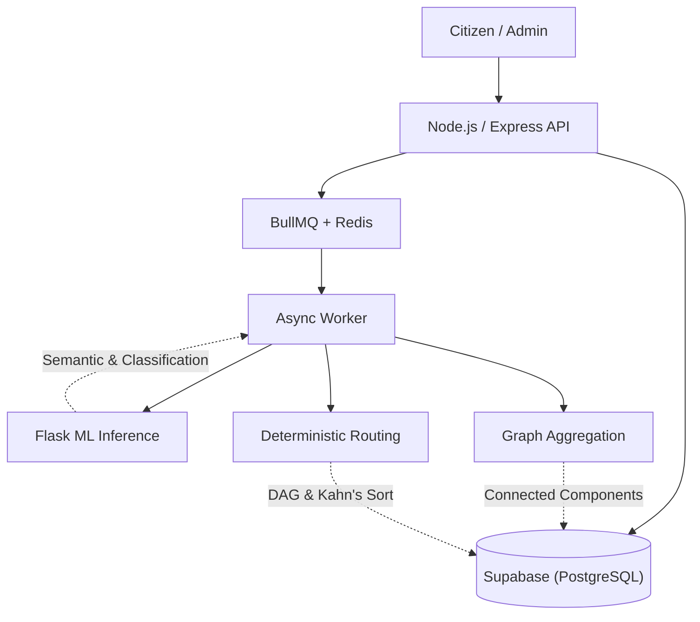

<div align="center">


<h1 align="center">GrievanceIQ</h1>

**AI-powered civic grievance processing and dependency-aware workflow system.**

[](LICENSE)
[](.github/workflows/backend-ci.yml)
[](.github/workflows/frontend-ci.yml)

| Problem | Architecture | AI/ML | Persistence |
|:---|:---|:---|:---|
| Unstructured, duplicate, multi-issue complaints | React 19 Frontend + Node.js Backend + Flask ML | MiniLM Embeddings + Random Forest Relationship Detection | PostgreSQL + Redis (BullMQ) |

</div>

---

## Overview

GrievanceIQ is an end-to-end intelligent pipeline designed to solve the complexity of civic complaints. Citizen complaints are often unstructured, duplicated, ambiguous, and geographically scattered. GrievanceIQ ingests these complaints, uses semantic representation and machine learning to understand and group them, and relies on deterministic logic to route tasks and manage dependencies.

## Architecture



> For complete architectural blueprints, see [docs/architecture](/docs/architecture).

## How It Works

1. **Semantic Representation & Classification:** Unstructured text is transformed using a 384-dimensional `MiniLM-L6-v2` embedding. A multi-label classifier then predicts which of 9 issue categories apply.
2. **Relationship Detection:** A Random Forest classifier evaluates complaint pairs (using semantic, location, and temporal features) to detect duplicates or related incidents.
3. **Civic Issue Grouping:** Using undirected graph traversal (Connected Components), related complaints are merged into unified "Civic Issues".
4. **Deterministic Routing:** Based on canonical issue types, deterministic rules generate workstreams and assign departments.
5. **Dependency-Aware Execution:** Operational tasks are structured as a Directed Acyclic Graph (DAG) and ordered using Kahn's algorithm, ensuring prerequisite tasks block subsequent actions until completed.

## Core Engineering Decisions

### Separation of ML and Deterministic Logic
GrievanceIQ intentionally separates probabilistic machine learning (understanding text, classifying issues, detecting relationships) from deterministic workflow execution. Department routing and task generation are driven by explicit JSON rulesets rather than black-box AI, ensuring reliability and auditability.

### Transactional Workflow Execution
Task dependencies are managed as a DAG. Tasks remain blocked until prerequisites complete. Execution state transitions are handled via transactional PostgreSQL RPC calls to prevent race conditions during concurrent operator actions.

### Human-in-the-Loop Design
The system operates via near-real-time polling (5-second intervals) and controlled human operator execution. It generates task templates for administrators; it does *not* attempt autonomous physical municipal dispatch.

## Validation & Evaluation

GrievanceIQ relies on rigorous evaluation metrics over synthetic held-out data:
- **Multi-Label Classification:** The multi-label issue classifier component achieves a **98.53% Micro-F1** score across 9 civic categories.
- **Relationship Detection:** The Random Forest relationship classifier achieves **93.30%** test accuracy in identifying duplicates and related incidents.

> For detailed metric breakdowns and confusion matrices, see [docs/evaluation](/docs/evaluation).

## Technology Stack

### Application & APIs
- **Frontend:** React 19, Vite, TypeScript, TailwindCSS
- **Backend:** Node.js 22, Express.js, JWT, Zod
- **Async Queue:** BullMQ, Redis

### AI / ML
- **Embeddings:** `Xenova/all-MiniLM-L6-v2`
- **Models:** Logistic Regression (Classification), Random Forest (Relationships)
- **Serving:** Python 3.10, Flask

### Infrastructure
- **Database:** Supabase (PostgreSQL)
- **CI/CD:** GitHub Actions (Backend & Frontend)

## Quick Start

### Prerequisites
- Node.js 22+
- Python 3.10+
- Redis Server
- Supabase account/instance

### Setup

```bash
git clone https://github.com/Vishh70/grievanceiq.git
cd grievanceiq

# Setup Backend
cd backend
npm install
npm run build
npm start

# Setup ML Service (Separate Terminal)
cd ml-service
python -m venv venv
source venv/bin/activate  # Windows: venv\Scripts\activate
pip install -r requirements.txt
python app.py

# Setup Frontend (Separate Terminal)
cd frontend
npm install
npm run dev
```

> Note: You must configure the `.env` files in `backend/` and `frontend/` as outlined in `backend/.env.example`.

## Limitations

- **Prototype Heuristics:** Duplicate detection thresholds (e.g., 500m radius) are currently set via prototype heuristics and have not been calibrated against historical municipal data.
- **Service Isolation:** The Python ML inference service is a basic Flask wrapper containing trained artifacts. It currently lacks production-grade service isolation and endpoint authentication.
- **Asynchronous Latency:** Complaint processing relies on BullMQ worker availability. Sudden spikes in queue length will delay the formation of graph relationships.

## Roadmap

- [ ] Transition ML service to a production-grade inference server (e.g., ONNX Runtime or FastAPI).
- [ ] Implement WebSocket real-time updates to replace the 5-second polling strategy.
- [ ] Calibrate relationship classifier thresholds using historical open municipal data.

## License

This project is licensed under the [MIT License](LICENSE).

---
*GrievanceIQ — Engineering deterministic workflows from unstructured civic data.*
