# GrievanceIQ

An AI-driven civic grievance intelligence and operational workflow platform that transforms unstructured citizen complaints into structured Civic Issues, deterministic departmental workstreams, and dependency-aware municipal tasks.

[](https://github.com/Vishh70/grievanceiq/actions/workflows/backend-ci.yml)
[](https://github.com/Vishh70/grievanceiq/actions/workflows/frontend-ci.yml)

## Project Overview

Citizen complaints to municipalities are often unstructured, duplicated, ambiguous, contain multiple issues, are geographically related, and are difficult to route manually. 

GrievanceIQ is designed to solve this by transforming:
unstructured complaint -> semantic representation -> issue classification -> duplicate/relationship analysis -> Civic Issue grouping -> canonical issue types -> deterministic departmental routing -> workstreams -> tasks -> dependency DAG -> executable task sequence.

The system combines local semantic embeddings, trained ML classification, relationship classification, domain Knowledge Graph enrichment, graph algorithms, deterministic workflow generation, and transactional task execution.

## Why GrievanceIQ?

| Problem | GrievanceIQ approach |
|---|---|
| Duplicate complaints | Hybrid semantic/location/time duplicate detection |
| Multiple complaints about same incident | Relationship classification + graph grouping |
| Multiple issue types in one complaint | Multi-label classifier |
| Unclear department responsibility | Deterministic issue-type → department mapping |
| Operational sequencing | Dependency DAG + Kahn's algorithm |
| Inconsistent updates | Transactional task execution |
| Relationship explainability | Knowledge Graph enrichment |
| Data loss during issue merging | Deterministic Civic Issue merge policy |
| Process transparency | PROCESSING → PROCESSED / FAILED lifecycle |

## Core Features

### Intelligent Complaint Intake
- complaint persistence
- processing lifecycle
- semantic embedding generation

### Multi-Label Issue Classification
- MiniLM embeddings
- Python Flask inference
- nine individual Logistic Regression models
- per-label thresholds

### Duplicate Detection
A hybrid approach combining:
- semantic similarity
- location similarity
- temporal relevance

### Relationship Classification
- corrected sklearn Random Forest
- Python Flask service
- four relationship classes:
  - Duplicate
  - Similar
  - Related
  - Independent
- 20 structured features
The corrected Python model is authoritative.

### Relationship Persistence
- PostgreSQL `complaint_relationships`
- canonical complaint-pair ordering
- uniqueness constraint
- relationship type
- confidence
- reason
- indexes

### Knowledge Graph
The Civic Knowledge Graph serves as an enrichment/evidence layer. It does NOT replace the relationship classifier.

### Civic Issue Aggregation
- complaint relationship graph
- connected components
- single complaint handling
- multiple complaint grouping
- deterministic merging of existing Civic Issues

### Department Routing
canonical issue type → deterministic department mapping

### Workstreams and Tasks
Deterministic task templates automatically generate workflows.

### Dependency DAG
- task prerequisites
- Kahn topological sort
- cycle detection
- parallel execution stages

### Transactional Execution
- task status
- task history
- workstream status
- transactional database update

## Architecture Diagram

```mermaid
flowchart LR
    A[Citizen] --> B[React Frontend]
    B --> C[Node.js / Express]
    C --> D[Complaint Persistence]

    D --> E[MiniLM Embedding]
    E --> F[Python Flask ML Service]

    F --> F1[9-label multi-label Logistic Regression classifier]
    F --> F2[corrected sklearn Random Forest relationship classifier]

    D --> G[Duplicate Detection]
    F2 --> H[Relationship Persistence]

    H --> I[Complaint relationship graph]
    I --> J[Connected Components]
    J --> K[Civic Issue]

    K --> L[Canonical Issue Types]
    L --> M[Deterministic issue-type -> department mapping]
    M --> N[Workstreams]
    N --> O[Tasks]
    O --> P[Dependency DAG]
    P --> Q[Kahn's topological sort]
    Q --> R[Transactional task execution]

    K --> S[Knowledge Graph Enrichment]
```



## End-to-End Processing Pipeline

1. Citizen submits complaint.
2. Complaint is persisted.
3. Processing state becomes `PROCESSING`.
4. Complaint worker processes the complaint.
5. Gemini performs initial complaint understanding/triage.
6. `Xenova/all-MiniLM-L6-v2` generates a 384-dimensional embedding.
7. 9-label multi-label Logistic Regression classifier predicts issue labels.
8. Duplicate detection evaluates semantic, location, and temporal signals.
9. Candidate relationships are classified by the corrected sklearn Random Forest relationship classifier.
10. Accepted relationship edges are persistently stored.
11. Complaint relationship graph is built.
12. Connected Components form Civic Issues.
13. Civic Issue metadata is aggregated.
14. Existing Civic Issues are merged using a deterministic policy when necessary.
15. Knowledge Graph relations provide supporting domain evidence.
16. Canonical issue types are mapped to departments deterministically.
17. Department workstreams are generated.
18. Task templates create operational tasks.
19. Task dependencies create a DAG.
20. Kahn's topological sort produces executable stages.
21. Tasks execute through transactional status updates.
22. Successful processing ends in `PROCESSED`.
23. Processing failures end in `FAILED`.

## Machine Learning Architecture

| Component | Technology | Role |
|---|---|---|
| Embeddings | `Xenova/all-MiniLM-L6-v2` | 384-dimensional semantic representation |
| Issue Classification | 9 Logistic Regression models | Multi-label canonical issue prediction |
| Relationship Classification | sklearn Random Forest | Duplicate / Similar / Related / Independent |
| Inference API | Flask | Serves trained `.joblib` models |
| Relationship Enrichment | Civic Knowledge Graph | Supporting domain evidence |

The Node.js backend communicates with Python over HTTP/JSON.
> The Node.js backend does not load the relationship `.joblib` directly.

## Relationship Model Evaluation

The corrected relationship model was trained on 8,818 training pairs, validated on 901 validation pairs, and evaluated on 836 held-out synthetic test pairs.

- Original dataset pairs: 16,000
- Usable pairs: 10,555
- Excluded pairs: 5,445
- Training pairs: 8,818
- Validation pairs: 901
- Held-out test pairs: 836
- Random Forest trees: 10
- Random seed: 42
- Test accuracy: 93.30%
- Macro F1: 89.99%

> These are synthetic held-out evaluation results and should not be interpreted as real-world municipal deployment accuracy.

## Multi-Label Issue Model

The issue classification design features:
- 9 fine-grained issue labels
- multi-label prediction
- individual Logistic Regression classifiers
- `Xenova/all-MiniLM-L6-v2` embeddings
- learned per-label thresholds
- Python Flask ML inference service

## Relationship Classes

| Class | Meaning |
|---|---|
| Duplicate | Same underlying complaint/incident |
| Similar | Similar issue characteristics but not confidently the same incident |
| Related | Distinct complaints that belong to the same broader causal/domain issue |
| Independent | No meaningful relationship |

## Civic Issue Merge Policy

When a newly processed complaint bridges multiple existing Civic Issues, the system selects the surviving Civic Issue deterministically.

The ranking is calculated as follows:
1. Maximum existing complaint count.
2. Highest priority: `Critical > High > Medium > Low`.
3. Oldest `created_at`.
4. Lexical UUID tie-breaker.

- losing Civic Issues are marked `Merged`
- `merged_into_id` preserves traceability
- complaints are reassigned/preserved according to implementation
- relationship data is not silently discarded

## Database Architecture

PostgreSQL/Supabase persists the operational state. Key tables include:
- `complaints`
- `civic_issues`
- `complaint_relationships`
- `routing_results`
- `workstreams`
- `tasks`
- `task_dependencies`
- `task_status_history`

Traceability for Civic Issue merging is enabled via the `merged_into_id` field. The relationship persistence was introduced in the `phase12_relationships.sql` migration.

## Database Migrations

Migrations should be executed in the documented order in the Supabase SQL Editor. 
1. `phase1_embedding.sql`
2. `phase2_duplicate_detection.sql`
3. `phase4_civic_issue.sql`
4. `phase5_routing_tasks.sql`
5. `phase6_task_dependencies.sql`
6. `phase7_task_execution.sql`
7. `phase8_task_hardening.sql`
8. `phase10_ml_multilabel.sql`
9. `phase11_google_auth.sql`
10. `phase12_relationships.sql`

[Database Migration Guide](docs/database/migration_guide.md)

## Project Structure

```text
grievanceiq/
├── backend/
│   ├── src/
│   │   ├── controllers/
│   │   ├── services/
│   │   ├── workers/
│   │   └── ...
│   ├── ml/
│   │   ├── inference/
│   │   ├── models/
│   │   ├── training_data/
│   │   └── requirements.txt
│   ├── tests/
│   └── package.json
├── frontend/
│   ├── src/
│   └── package.json
├── docs/
│   ├── database/
│   ├── evaluation/
│   └── ...
└── .github/
    └── workflows/
```

## Technology Stack

| Layer | Technology |
|---|---|
| Frontend | React + Vite |
| Backend | Node.js + Express |
| Database | Supabase / PostgreSQL |
| Embeddings | `Xenova/all-MiniLM-L6-v2` |
| ML Inference | Python + Flask |
| ML | scikit-learn |
| Queue | BullMQ / Redis |
| Graph Processing | Complaint relationship graph + Connected Components |
| Workflow Planning | Kahn's topological sort |
| Testing | Jest / integration / E2E scripts |
| CI | GitHub Actions |

## Local Setup

### Prerequisites
- Node.js v22+
- Python 3.10+
- Supabase Project (PostgreSQL with `pgvector` enabled)
- Redis server (for BullMQ)

### Installation
```bash
git clone https://github.com/Vishh70/grievanceiq.git
cd grievanceiq

cd backend
npm ci

cd ../frontend
npm ci
```

### Python Environment Setup
```bash
cd backend/ml
pip install -r requirements.txt
```

### Environment Variables
Create a `.env` file in the `backend/` directory:
```env
SUPABASE_URL=your_supabase_url
SUPABASE_ANON_KEY=your_supabase_anon_key
GEMINI_API_KEY=your_gemini_api_key
ML_SERVICE_URL=http://localhost:5001
NODE_ENV=development
```
> Never commit `.env` files or secret credentials to Git.

## Running the Application

### Start ML service
```bash
cd backend/ml
python inference/grievanceiq_inference.py
```

### Start backend
Ensure Redis is running locally.
```bash
cd backend
npm run dev
```

### Start frontend
```bash
cd frontend
npm run dev
```

## Testing

Backend test execution:
```bash
cd backend
npm test
npm run test:e2e
npm run test:integration
```
Frontend test execution:
```bash
cd frontend
npm test
```

## CI/CD

### Backend CI
The backend workflow ([backend-ci.yml](.github/workflows/backend-ci.yml)):
- installs Node dependencies
- installs Python dependencies
- starts Flask ML service
- checks `/health`
- tests `/predict`
- tests `/predict-relationship`
- runs backend tests
- runs MiniLM smoke testing

### Frontend CI
The frontend workflow ([frontend-ci.yml](.github/workflows/frontend-ci.yml)):
- installs dependencies
- builds the frontend

## Demo

To inject a reproducible demonstration scenario:
```bash
cd backend
npm run demo
```
This data is explicitly tagged with `[DEMO]`.

To safely remove all generated demo data:
```bash
cd backend
npm run demo:reset
```

## API / Service Overview

- `POST /complaints/new` - Submit a new complaint
- `GET /complaints/:id/status` - Poll processing status
- `GET /complaints/:id/similar` - Retrieve similar complaint candidates
- `POST /predict` (ML Service) - Issue classification
- `POST /predict-relationship` (ML Service) - Relationship inference

## Processing States

| State | Meaning |
|---|---|
| `PROCESSING` | Complaint is being analyzed and orchestrated |
| `PROCESSED` | Full processing pipeline completed |
| `FAILED` | Processing encountered an unrecoverable error |

The frontend polls the processing state automatically.

## Explainability

GrievanceIQ avoids being a "black-box AI" by incorporating explainability through:
- deterministic issue-type → department mapping
- Complaint relationship graph + Connected Components
- Civic Knowledge Graph evidence
- Relationship confidence scores
- Deterministic Civic Issue merge policy
- Explicit task dependencies
- Transactional task execution

## Algorithms

| Algorithm / Method | Purpose |
|---|---|
| `Xenova/all-MiniLM-L6-v2` embeddings | Semantic representation |
| Cosine similarity | Semantic comparison |
| Haversine distance | Geographic proximity |
| Temporal scoring | Complaint recency/relevance |
| 9-label multi-label Logistic Regression classifier | Multi-label canonical issue prediction |
| corrected sklearn Random Forest relationship classifier | Relationship classification |
| Complaint relationship graph + Connected Components | Civic Issue grouping |
| DAG | Task dependency modeling |
| Kahn's topological sort | Topological execution order |
| Cycle detection | Dependency validation |
| Deterministic ranking | Civic Issue merge policy |

## Security and Privacy
- secrets belong in environment variables
- credentials must not be committed (`.env` is protected)
- authenticated operations use JWT/Supabase controls where implemented
- local ML artifacts are served through the internal inference service

## Limitations

[Evaluation Limitations](docs/evaluation/limitations.md)

### Dataset
- synthetic datasets
- prototype-scale evaluation
- limited evidence for real-world municipal language

### Model evaluation
- held-out synthetic data
- metrics are not production accuracy

### Duplicate detection
- heuristic thresholds
- not calibrated on historical municipal data

### Workflow
- no resource-aware workforce optimization
- no travel-time optimization
- no cross-Civic-Issue resource conflict scheduling

### Integrations
- no live municipality system integration
- no live government database integration
- no live GPS/field workforce integration
- no autonomous dispatch

### Deployment
- no production-scale municipality validation

## Future Roadmap (FUTURE WORK)
- image similarity / CLIP-based evidence
- priority aggregation improvements
- workforce/resource-aware scheduling
- cross-Civic-Issue dependency management
- richer explainability
- real municipal historical dataset evaluation
- authentication hardening for ML service
- production deployment hardening

## Viva-ready Technical Summary

| Question | Answer |
|---|---|
| Primary embedding model | `Xenova/all-MiniLM-L6-v2`, 384 dimensions |
| Issue classifier | 9-label multi-label Logistic Regression classifier |
| Relationship classifier | corrected sklearn Random Forest relationship classifier served by Flask |
| Relationship classes | Duplicate, Similar, Related, Independent |
| Grouping method | Complaint relationship graph + Connected Components |
| Routing method | Deterministic issue-type → department mapping |
| Task planning | DAG + Kahn's topological sort |
| Execution consistency | Transactional Supabase/PostgreSQL RPC |
| Evaluation dataset | Synthetic prototype dataset |
| Relationship test set | 836 held-out pairs |
| Relationship test accuracy | 93.30% |
| Relationship macro F1 | 89.99% |

## Research / Evaluation Disclosure
> GrievanceIQ is a prototype/academic civic intelligence system. Model results are based on synthetic datasets and controlled evaluation scenarios. They demonstrate the implemented pipeline and experimental performance, not guaranteed real-world municipal deployment performance.

---
GrievanceIQ demonstrates how unstructured civic complaints can be transformed into structured, explainable, dependency-aware municipal workflows by combining semantic embeddings, multi-label classification, relationship modeling, graph algorithms, deterministic routing, and transactional task execution.

This project is an academic/prototype implementation and has not been validated at production municipality scale.
