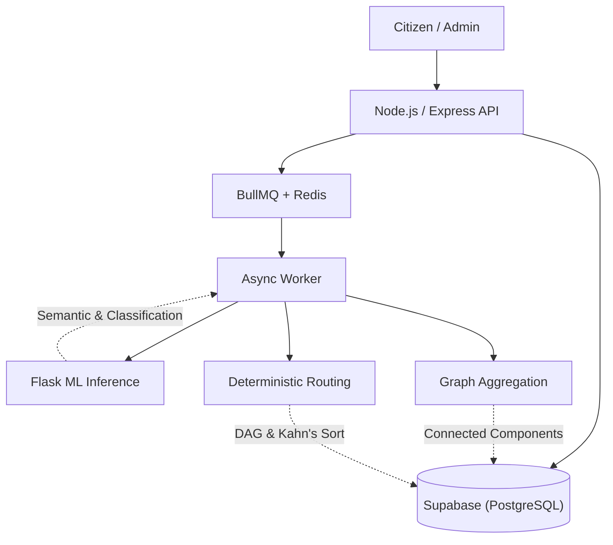
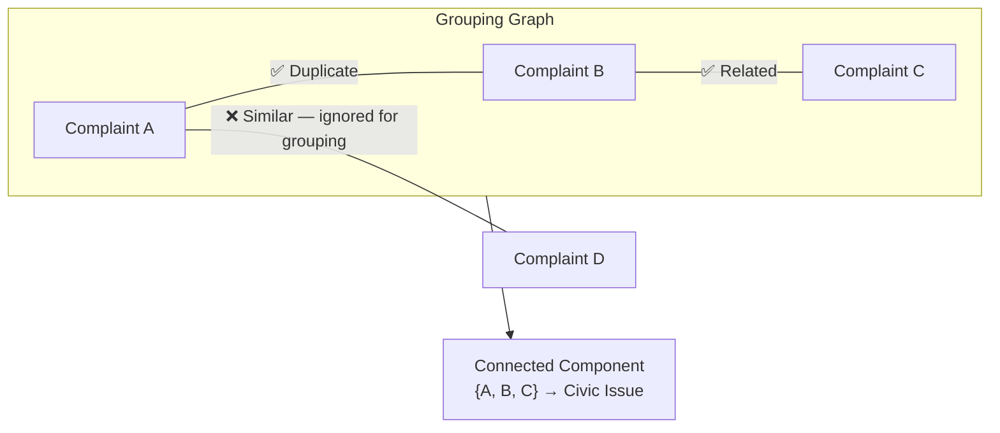
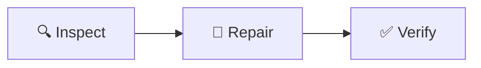
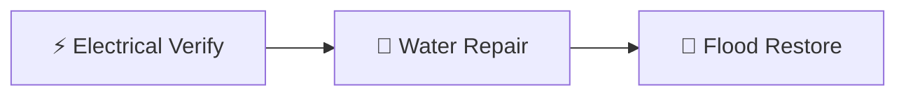
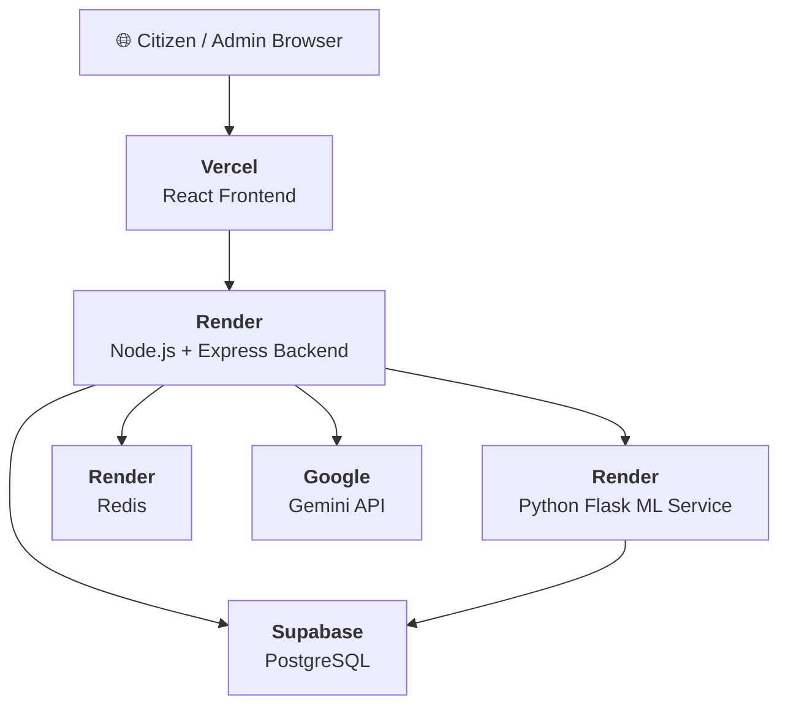
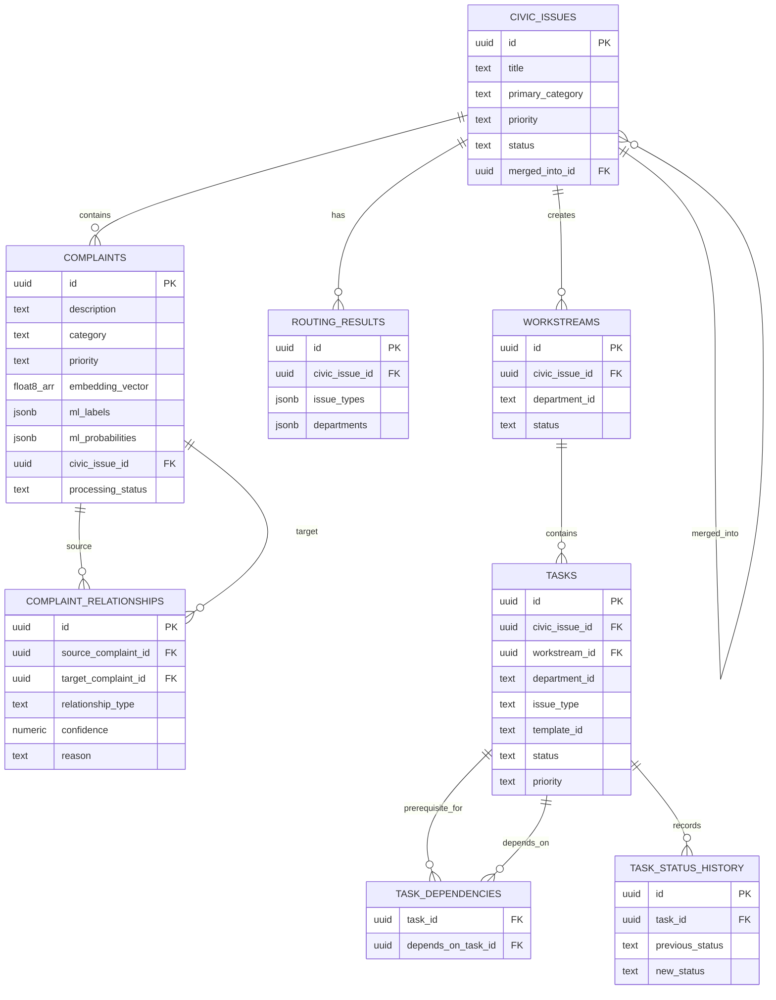

<div align="center">


<h1 align="center">GrievanceIQ</h1>

**AI-powered civic grievance processing and dependency-aware workflow system.**

[](LICENSE)
[](.github/workflows/backend-ci.yml)
[](.github/workflows/frontend-ci.yml)

| Problem | Architecture | AI/ML | Persistence |
|:---|:---|:---|:---|
| Unstructured, duplicate, multi-issue complaints | React 19 Frontend + Node.js Backend + Flask ML | MiniLM Embeddings + Random Forest Relationship Detection | PostgreSQL + Redis (BullMQ) |

</div>

---

## Overview

GrievanceIQ is an end-to-end intelligent pipeline designed to solve the complexity of civic complaints. Citizen complaints are often unstructured, duplicated, ambiguous, and geographically scattered. GrievanceIQ ingests these complaints, uses semantic representation and machine learning to understand and group them, and relies on deterministic logic to route tasks and manage dependencies.

## Architecture



> For complete architectural blueprints, see [docs/architecture](/docs/architecture).

## How It Works

1. **Semantic Representation & Classification:** Unstructured text is transformed using a 384-dimensional `MiniLM-L6-v2` embedding. A multi-label classifier then predicts which of 9 issue categories apply.
2. **Relationship Detection:** A Random Forest classifier evaluates complaint pairs (using semantic, location, and temporal features) to detect duplicates or related incidents.
3. **Civic Issue Grouping:** Using undirected graph traversal (Connected Components), related complaints are merged into unified "Civic Issues".
4. **Deterministic Routing:** Based on canonical issue types, deterministic rules generate workstreams and assign departments.
5. **Dependency-Aware Execution:** Operational tasks are structured as a Directed Acyclic Graph (DAG) and ordered using Kahn's algorithm, ensuring prerequisite tasks block subsequent actions until completed.

## Core Engineering Decisions

### Separation of ML and Deterministic Logic
GrievanceIQ intentionally separates probabilistic machine learning (understanding text, classifying issues, detecting relationships) from deterministic workflow execution. Department routing and task generation are driven by explicit JSON rulesets rather than black-box AI, ensuring reliability and auditability.

### Transactional Workflow Execution
Task dependencies are managed as a DAG. Tasks remain blocked until prerequisites complete. Execution state transitions are handled via transactional PostgreSQL RPC calls to prevent race conditions during concurrent operator actions.

### Human-in-the-Loop Design
The system operates via near-real-time polling (5-second intervals) and controlled human operator execution. It generates task templates for administrators; it does *not* attempt autonomous physical municipal dispatch.

## Validation & Evaluation

GrievanceIQ relies on rigorous evaluation metrics over synthetic held-out data:
- **Multi-Label Classification:** The multi-label issue classifier component achieves a **98.53% Micro-F1** score across 9 civic categories.
- **Relationship Detection:** The Random Forest relationship classifier achieves **93.30%** test accuracy in identifying duplicates and related incidents.

> For detailed metric breakdowns and confusion matrices, see [docs/evaluation](/docs/evaluation).

## Technology Stack

### Application & APIs
- **Frontend:** React 19, Vite, TypeScript, TailwindCSS
- **Backend:** Node.js 22, Express.js, JWT, Zod
- **Async Queue:** BullMQ, Redis

### AI / ML
- **Embeddings:** `Xenova/all-MiniLM-L6-v2`
- **Models:** Logistic Regression (Classification), Random Forest (Relationships)
- **Serving:** Python 3.10, Flask

### Infrastructure
- **Database:** Supabase (PostgreSQL)
- **CI/CD:** GitHub Actions (Backend & Frontend)

    Note over Citizen,ROUTE: ⏳ Operational task execution occurs later through the admin workflow.

    actor Admin
    Admin->>FE: Start task
    FE->>API: PATCH /api/tasks/:id/status
    API->>DB: Read task + dependencies
    API->>API: Validate readiness
    API->>DB: Transactional RPC
    DB-->>API: Updated task state
    API-->>FE: Task status
```


<div align="right"><a href="#-table-of-contents">⬆ Back to Top</a></div>

---

### Complaint Relationship Graph

GrievanceIQ distinguishes between **relationship prediction** and **graph grouping**:



> [!IMPORTANT]
> The relationship classifier predicts `Duplicate`, `Similar`, `Related`, or `Independent`. For Civic Issue formation, **only `Duplicate` and `Related`** create graph edges. `Similar` is intentionally excluded to reduce false merges.


<div align="right"><a href="#-table-of-contents">⬆ Back to Top</a></div>

---

### Task Dependency Graph

<table>
<tr>
<td>

**Single-department pipeline:**


</td>
<td>

**Cross-department dependencies:**


</td>
</tr>
</table>

```
Dependency Rules → Directed Acyclic Graph → Cycle Detection → Kahn's Topological Sort → Execution Stages → Readiness Checks
```


<div align="right"><a href="#-table-of-contents">⬆ Back to Top</a></div>

---

### Deployment Architecture



> [!CAUTION]
> The ML service is a separately deployed Flask service containing trained inference artifacts. The current prototype deployment does not constitute production-grade service isolation or endpoint authentication.


<div align="right"><a href="#-table-of-contents">⬆ Back to Top</a></div>

---

##  Core Features

<details>
<summary><b>🧠 Intelligent Complaint Intake</b></summary>

- Complaint persistence with full metadata
- Asynchronous BullMQ processing for AI/ML tasks
- `PROCESSING → PROCESSED / FAILED` lifecycle management
- Gemini-powered initial complaint understanding
- Near-real-time 5-second status polling from frontend

</details>

<details>
<summary><b>🏷️ Multi-Label Issue Classification</b></summary>

- **Model:** 9 independent Logistic Regression classifiers
- **Embeddings:** `Xenova/all-MiniLM-L6-v2` (384-dimensional)
- **Labels:** Road damage · Roadside flooding · Water leakage · Electric pole · Streetlight · Traffic signal · Garbage · Tree hazard · Drainage
- **Thresholds:** Per-label learned thresholds for precision-recall balance
- **Serving:** Python Flask inference at `/predict`

</details>

<details>
<summary><b>🔍 Duplicate Detection</b></summary>

Hybrid scoring combining three signals:
- **Semantic similarity** — Cosine similarity on MiniLM embeddings
- **Location similarity** — Haversine distance calculation
- **Temporal relevance** — Time-decay scoring

</details>

<details>
<summary><b>🔗 Relationship Classification</b></summary>

- **Model:** scikit-learn Random Forest (10 trees)
- **Classes:** `Duplicate` · `Similar` · `Related` · `Independent`
- **Features:** 20 structured features (semantic, location, temporal, category-pair)
- **Serving:** Python Flask inference at `/predict-relationship`
- **Storage:** Persistent `complaint_relationships` table with canonical ordering

</details>

<details>
<summary><b>🏘️ Civic Issue Aggregation</b></summary>

- Complaint relationship graph construction
- Connected Components for grouping
- Single-complaint → new Civic Issue
- Multi-complaint → merge into existing Civic Issue
- **Deterministic merge policy:** complaint count → priority → age → UUID

</details>

<details>
<summary><b>🏢 Deterministic Department Routing & Task Execution</b></summary>

- Deterministic department routing based on aggregated supervised ML issue labels
- Automatic workstream generation
- Task template instantiation (generates actionable tasks for operators — does *not* dispatch physical municipal workers)
- Dependency DAG with cycle detection
- Kahn's topological sort for execution ordering
- Transactional PostgreSQL status updates

</details>

<details>
<summary><b>🌐 Knowledge Graph</b></summary>

Domain enrichment and evidence layer for relationship explainability. The Knowledge Graph supplements — it does **not** replace — the ML relationship classifier.

</details>


<div align="right"><a href="#-table-of-contents">⬆ Back to Top</a></div>

---

##  AI / ML Pipeline

GrievanceIQ utilizes **three distinct intelligence mechanisms** operating in concert:

<table>
<tr>
<td align="center" width="33%">

### 🤖 Gemini

**Initial Understanding**

External API call for complaint triage and initial categorization.

*Not the trained issue classifier.*

</td>
<td align="center" width="33%">

### 🏷️ Multi-Label Classifier

**9 Issue Categories**

`Complaint Text`<br/>↓<br/>`384-dim MiniLM Embedding`<br/>↓<br/>`9 × Logistic Regression`<br/>↓<br/>`9 Boolean Issue Flags`

</td>
<td align="center" width="33%">

### 🔗 Relationship Classifier

**Complaint Pairs**

`A + B`<br/>↓<br/>`20 Structured Features`<br/>↓<br/>`Random Forest (10 trees)`<br/>↓<br/>`Dup / Sim / Rel / Ind`

</td>
</tr>
</table>

### Duplicate Detection

**Algorithm:** Hybrid weighted scoring

```
Duplicate Score = (0.50 × Semantic) + (0.30 × Location) + (0.20 × Temporal)
```

| Parameter | Value |
|:----------|------:|
| Candidate age window | `30 days` |
| Max candidates evaluated | `100` |
| Duplicate score threshold | `0.80` |
| Minimum semantic similarity | `0.75` |
| Maximum duplicate radius | `500m` |
| Strict temporal window | `48h` |

> [!WARNING]
> These thresholds are prototype heuristics and have **not** been calibrated against historical municipal duplicate records.

### Relationship Feature Vector (20 Features)

<table>
<tr>
<td>

**6 Scalar Features**
1. `semantic_similarity`
2. `location_score`
3. `temporal_score`
4. `duplicate_score`
5. `duplicate_flag`
6. `same_category`

</td>
<td>

**7 Category Indicators (A)**
7–13. Category flags for Complaint A

</td>
<td>

**7 Category Indicators (B)**
14–20. Category flags for Complaint B

</td>
</tr>
</table>

```
6 scalar + 7 category_A + 7 category_B = 20 total features
```

### Knowledge Graph

> [!NOTE]
> The Knowledge Graph is a **domain enrichment and explainability layer**. It is NOT the primary relationship classifier.


<div align="right"><a href="#-table-of-contents">⬆ Back to Top</a></div>

---

##  Civic Issue Formation

Civic Issues are formed using **undirected graph traversal (Connected Components)**.

| Aspect | Detail |
|:-------|:-------|
| **Edge creation** | Strictly `Duplicate` and `Related` ML predictions |
| **Ignored** | `Similar` — intentionally excluded to prevent false-positive over-merging |
| **Merge policy** | Deterministic: `Highest complaint count` → `Priority` → `Age` → `UUID` |


<div align="right"><a href="#-table-of-contents">⬆ Back to Top</a></div>

---

##  Deterministic Routing

Department routing is entirely deterministic — no separate "routing model" exists.

```
Complaint-level ML labels
       ↓
Aggregate across Civic Issue
       ↓
Canonical issue types
       ↓
routing_rules.json
       ↓
Department mapping
       ↓
Workstreams → Tasks → Dependencies
```

<table>
<tr>
<td>

**Single Issue:**<br/>
`Water Leakage` → `Water Dept` → `Inspect` → `Repair` → `Verify`

</td>
<td>

**Multi-Issue:**<br/>
`Water Leakage + Flooding` → `Water + Drainage Depts` → `Separate Workstreams` → `Cross-dept Dependencies`

</td>
</tr>
</table>


<div align="right"><a href="#-table-of-contents">⬆ Back to Top</a></div>

---

## 📋 Workflow & Task Execution

| Concept | Implementation |
|:--------|:---------------|
| **Structure** | Directed Acyclic Graph (DAG) of task dependencies |
| **Ordering** | Kahn's Topological Sort with cycle detection |
| **Blocking** | Task remains `NOT VERIFIED` until all prerequisites are `COMPLETED` |
| **State Machine** | `PENDING` → `IN_PROGRESS` → `COMPLETED` / `CANCELLED` |
| **Consistency** | Transactional PostgreSQL RPC for atomic status transitions |


<div align="right"><a href="#-table-of-contents">⬆ Back to Top</a></div>

---

##  Evaluation Results

> [!CAUTION]
> All ML metrics are based on **synthetic held-out evaluation data** and must not be interpreted as real-world municipal accuracy.

<table>
<tr>
<td width="50%">

### 🔗 Relationship Classifier

| Metric | Value |
|:-------|------:|
| **Test Accuracy** | **93.30%** |
| Macro Precision | 86.86% |
| Macro Recall | 94.76% |
| **Macro F1** | **89.99%** |

| Config | Detail |
|:-------|:-------|
| Dataset | 16,000 → 10,555 usable pairs |
| Split | 8,818 / 901 / 836 |
| Features | 20 |
| Model | Random Forest (10 trees) |
| `max_features` | 0.5 |
| `bootstrap` | true |
| `random_state` | 42 |

</td>
<td width="50%">

### 🏷️ Multi-Label Classifier

| Metric | Value |
|:-------|------:|
| **Exact Match** | **95.00%** |
| Micro Precision | 97.86% |
| Micro Recall | 99.21% |
| **Micro F1** | **98.53%** |
| Macro F1 | 98.50% |

| Config | Detail |
|:-------|:-------|
| Labels | 9 |
| Embedding | 384 dimensions |
| Split | 4,196 / 904 / 900 |
| Model | 9 × Logistic Regression |
| Thresholds | Per-label learned |
| Serving | Flask `/predict` |

</td>
</tr>
</table>

### Model Artifacts

```
backend/ml/models/
├── multilabel_classifier.joblib            # 9-label issue classifier
├── multilabel_thresholds.csv               # Per-label decision thresholds
├── relationship_corrected_rf_10tree.joblib  # Random Forest relationship model
├── relationship_features_list.txt          # 20 feature names
├── relationship_model_manifest.json        # Training metadata + metrics
└── issue_labels.json                       # Label definitions
```


<div align="right"><a href="#-table-of-contents">⬆ Back to Top</a></div>

---

##  Data Model



### Migrations

| # | Migration | Purpose |
|:-:|:----------|:--------|
| 1 | `phase1_embedding.sql` | Vector embeddings with `float8[]` |
| 2 | `phase2_duplicate_detection.sql` | Duplicate detection infrastructure |
| 3 | `phase4_civic_issue.sql` | Civic Issue tables |
| 4 | `phase5_routing_tasks.sql` | Routing + task tables |
| 5 | `phase6_task_dependencies.sql` | Task dependency DAG |
| 6 | `phase7_task_execution.sql` | Execution status tracking |
| 7 | `phase8_task_hardening.sql` | Transaction hardening |
| 8 | `phase10_ml_multilabel.sql` | Multi-label ML fields |
| 9 | `phase11_google_auth.sql` | Google OAuth tables |
| 10 | `phase12_relationships.sql` | Complaint relationships persistence |

📖 See [`docs/database/migration_guide.md`](docs/database/migration_guide.md) for details.


<div align="right"><a href="#-table-of-contents">⬆ Back to Top</a></div>

---

##  Repository Structure

```
grievanceiq/
│
├── 📂 backend/
│   ├── 📂 src/
│   │   ├── app.js                          # Express application setup
│   │   ├── server.js                       # HTTP server entry point
│   │   │
│   │   ├── 📂 controllers/                 # API route handlers
│   │   │   ├── authController.js           # JWT + Google OAuth
│   │   │   ├── complaintController.js      # Complaint CRUD + submission
│   │   │   ├── civicIssueController.js     # Civic Issue management
│   │   │   ├── dashboardController.js      # Admin dashboard data
│   │   │   └── userController.js           # User profile
│   │   │
│   │   ├── 📂 services/                    # Business logic layer
│   │   │   ├── aiService.js                # Gemini AI integration
│   │   │   ├── embeddingService.js         # MiniLM embedding generation
│   │   │   ├── duplicateDetectionService.js
│   │   │   ├── mlService.js                # Flask ML client
│   │   │   ├── relationshipService.js
│   │   │   ├── relationshipPersistenceService.js
│   │   │   ├── complaintGraphService.js    # Connected Components
│   │   │   ├── civicIssueService.js        # Merge policy
│   │   │   ├── knowledgeGraphService.js    # Enrichment layer
│   │   │   ├── routingService.js           # Deterministic routing
│   │   │   ├── taskDependencyService.js    # DAG + Kahn's sort
│   │   │   └── taskExecutionService.js     # Transactional RPC
│   │   │
│   │   ├── 📂 workers/
│   │   │   └── complaintWorker.js          # BullMQ job processor
│   │   │
│   │   ├── 📂 routes/                      # Express route definitions
│   │   ├── 📂 middleware/                   # Auth, rate-limiting
│   │   ├── 📂 config/                      # DB, queue config
│   │   └── 📂 utils/
│   │
│   ├── 📂 ml/
│   │   ├── 📂 inference/
│   │   │   ├── grievanceiq_inference.py    # Flask inference server
│   │   │   └── ci_smoke_test.py            # CI health check
│   │   ├── 📂 models/                      # Trained .joblib artifacts
│   │   ├── 📂 training_data/              # Synthetic datasets
│   │   ├── train_relationship.py           # Model training script
│   │   └── requirements.txt
│   │
│   ├── 📂 data/
│   │   ├── routing_rules.json              # Department mapping rules
│   │   └── civic_knowledge.json            # Knowledge graph data
│   │
│   ├── 📂 tests/
│   │   ├── 📂 unit/
│   │   ├── 📂 integration/
│   │   └── endToEnd.test.js
│   │
│   ├── 📂 scripts/                         # Demo seeding utilities
│   └── package.json
│
├── 📂 frontend/
│   ├── 📂 src/
│   │   ├── 📂 pages/                       # Route pages (11 views)
│   │   ├── 📂 components/                  # Shared UI components
│   │   ├── 📂 context/                     # React context providers
│   │   ├── 📂 services/                    # API client layer
│   │   └── 📂 utils/
│   └── package.json
│
├── 📂 docs/
│   ├── 📂 architecture/                    # Design documents
│   ├── 📂 database/                        # SQL migrations
│   ├── 📂 evaluation/                      # Model evaluation reports
│   └── 📂 research/                        # Research notes
│
├── 📂 .github/workflows/                   # CI/CD pipelines
│   ├── backend-ci.yml
│   └── frontend-ci.yml
│
├── render.yaml                              # Render deployment config
├── vercel.json                              # Vercel frontend config
└── README.md
```


<div align="right"><a href="#-table-of-contents">⬆ Back to Top</a></div>

---

##  Tech Stack

<table>
<tr>
<td align="center" width="110"><br/><b>Frontend</b></td>
<td>React 19 · Vite · React Router · Framer Motion · Recharts · Leaflet · Lucide Icons · PWA</td>
</tr>
<tr>
<td align="center"><br/><b>Backend</b></td>
<td>Node.js 22 · Express · BullMQ · ioredis · Zod · JWT · Google Auth</td>
</tr>
<tr>
<td align="center"><br/><b>ML Service</b></td>
<td>Python 3.10 · Flask · scikit-learn · joblib</td>
</tr>
<tr>
<td align="center"><br/><b>Embeddings</b></td>
<td>Xenova/all-MiniLM-L6-v2 · ONNX Runtime · 384 dimensions</td>
</tr>
<tr>
<td align="center"><br/><b>Database</b></td>
<td>Supabase · PostgreSQL (float8[] arrays for embeddings)</td>
</tr>
<tr>
<td align="center"><br/><b>Queue</b></td>
<td>BullMQ · Redis</td>
</tr>
<tr>
<td align="center"><br/><b>CI/CD</b></td>
<td>GitHub Actions · Node 22.x · Python 3.10</td>
</tr>
<tr>
<td align="center"><br/><b>Deploy</b></td>
<td>Render (backend + ML + Redis) · Vercel (frontend)</td>
</tr>
</table>


<div align="right"><a href="#-table-of-contents">⬆ Back to Top</a></div>

---

##  API Reference

<details>
<summary><b>📋 Backend API — Node.js + Express</b></summary>

#### Complaints

| Method | Endpoint | Description |
|:------:|:---------|:------------|
| `POST` | `/api/complaints` | Submit a new complaint |
| `GET` | `/api/complaints` | List all complaints |
| `GET` | `/api/complaints/:id` | Get complaint by ID |
| `GET` | `/api/complaints/:id/status` | Poll processing status |
| `GET` | `/api/complaints/:id/similar` | Get similar complaint candidates |
| `POST` | `/api/complaints/:id/upvote` | Upvote a complaint |

#### Civic Issues

| Method | Endpoint | Description |
|:------:|:---------|:------------|
| `GET` | `/api/civic-issues` | List all Civic Issues |
| `GET` | `/api/civic-issues/:id` | Get Civic Issue by ID |
| `POST` | `/api/civic-issues/:id/route` | Trigger routing |
| `GET` | `/api/civic-issues/:id/routing` | Get routing results |
| `GET` | `/api/civic-issues/:id/tasks` | Get tasks for Civic Issue |
| `GET` | `/api/civic-issues/:id/execution-plan` | Get execution plan |
| `GET` | `/api/civic-issues/:id/progress` | Get resolution progress |

#### Tasks

| Method | Endpoint | Description |
|:------:|:---------|:------------|
| `GET` | `/api/tasks/:id` | Get task by ID |
| `PATCH` | `/api/tasks/:id/status` | Update task status (transactional) |

#### System

| Method | Endpoint | Description |
|:------:|:---------|:------------|
| `GET` | `/api/health` | Backend health check |

</details>

<details>
<summary><b>🐍 Python ML Service — Flask</b></summary>

| Method | Endpoint | Description |
|:------:|:---------|:------------|
| `GET` | `/health` | ML service health check |
| `POST` | `/predict` | Multi-label issue classification (384-dim embedding input) |
| `POST` | `/predict-relationship` | Relationship inference (20-feature input) |

</details>

### Processing States

```
  ┌─────────────┐     ┌────────────┐
  │ PROCESSING  │────►│ PROCESSED  │  ✅ Success
  └──────┬──────┘     └────────────┘
         │
         │            ┌────────────┐
         └───────────►│   FAILED   │  ❌ Error
                      └────────────┘
```


<div align="right"><a href="#-table-of-contents">⬆ Back to Top</a></div>

---

##  Quick Start


### Prerequisites
- Node.js 22+
- Python 3.10+
- Redis Server
- Supabase account/instance

### Setup

```bash
git clone https://github.com/Vishh70/grievanceiq.git
cd grievanceiq

# Setup Backend
cd backend
npm install
npm run build
npm start

# Setup ML Service (Separate Terminal)
cd backend/ml
python -m venv venv
# Windows: venv\Scripts\activate
# Mac/Linux: source venv/bin/activate
pip install -r requirements.txt
python inference/grievanceiq_inference.py

# Setup Frontend (Separate Terminal)
cd frontend
npm install
npm run dev
```

> [!IMPORTANT]
> You must configure the `.env` files in `backend/` and `frontend/` before starting the application. See `backend/.env.example` for required variables.

## Limitations

- **Prototype Heuristics:** Duplicate detection thresholds (e.g., 500m radius) are currently set via prototype heuristics and have not been calibrated against historical municipal data.
- **Service Isolation:** The Python ML inference service is a basic Flask wrapper containing trained artifacts. It currently lacks production-grade service isolation and endpoint authentication.
- **Asynchronous Latency:** Complaint processing relies on BullMQ worker availability. Sudden spikes in queue length will delay the formation of graph relationships.

## Roadmap

- [ ] Transition ML service to a production-grade inference server (e.g., ONNX Runtime or FastAPI).
- [ ] Implement WebSocket real-time updates to replace the 5-second polling strategy.
- [ ] Calibrate relationship classifier thresholds using historical open municipal data.

## License

This project is licensed under the [MIT License](LICENSE).

---
*GrievanceIQ — Engineering deterministic workflows from unstructured civic data.*
