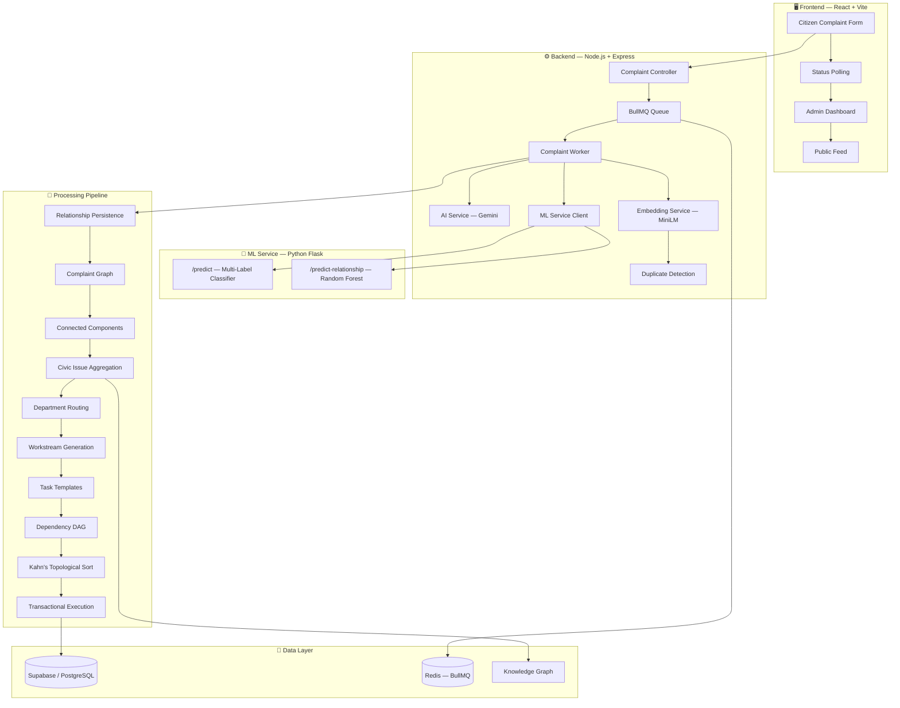
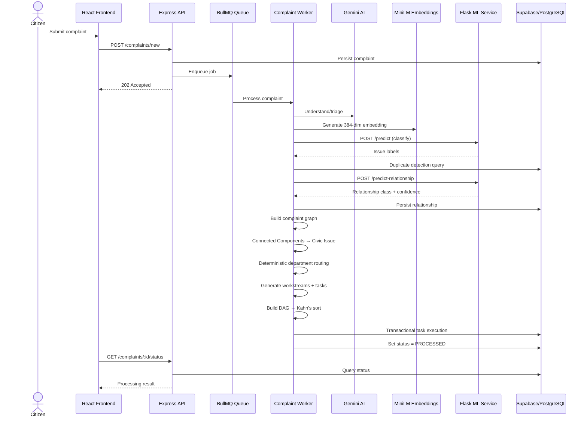
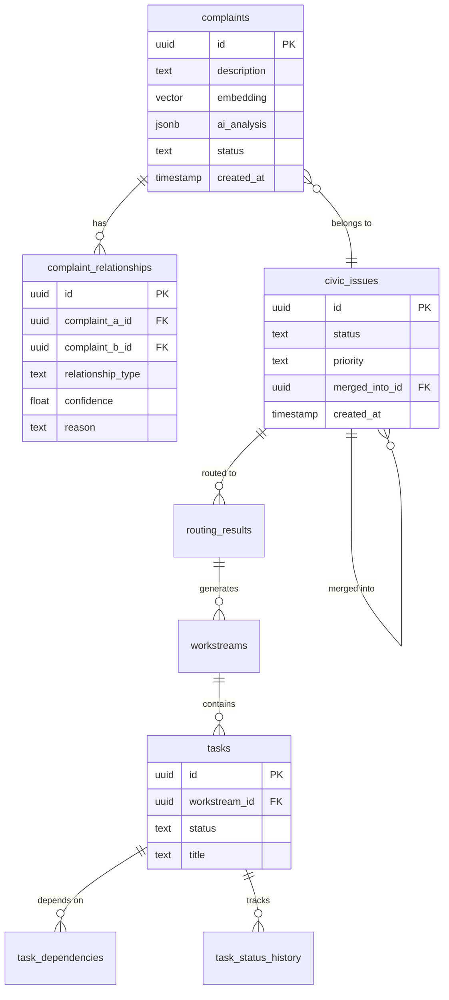

<p align="center">
  
</p>

<h1 align="center">🏛️ GrievanceIQ</h1>

<p align="center">
  <strong>AI-Driven Civic Grievance Intelligence & Operational Workflow Platform</strong>
</p>

<p align="center">
  <em>Transforming unstructured citizen complaints into structured Civic Issues,<br/>deterministic departmental workstreams, and dependency-aware municipal tasks.</em>
</p>

<p align="center">
  <a href="https://github.com/Vishh70/grievanceiq/actions/workflows/backend-ci.yml"></a>
  <a href="https://github.com/Vishh70/grievanceiq/actions/workflows/frontend-ci.yml"></a>
  
  
  
  
  
</p>

<p align="center">
  <a href="#-quick-start">Quick Start</a> •
  <a href="#-architecture">Architecture</a> •
  <a href="#-features">Features</a> •
  <a href="#-ml-pipeline">ML Pipeline</a> •
  <a href="#-api-reference">API Reference</a> •
  <a href="#-testing">Testing</a>
</p>

---

## 🎯 The Problem

Citizen complaints to municipalities are:

> **Unstructured** · **Duplicated** · **Ambiguous** · **Multi-issue** · **Geographically scattered** · **Hard to route manually**

GrievanceIQ solves this with an end-to-end intelligent pipeline:

```
📝 Unstructured Complaint
  → 🧠 Semantic Embedding (MiniLM-L6)
    → 🏷️ Multi-Label Classification (9 issue types)
      → 🔗 Relationship Detection (Random Forest)
        → 🏘️ Civic Issue Grouping (Connected Components)
          → 🏢 Department Routing (Deterministic Mapping)
            → 📋 Task Generation (DAG + Kahn's Sort)
              → ✅ Transactional Execution
```

## 💡 Why GrievanceIQ?

| Problem | GrievanceIQ Approach |
|:--------|:---------------------|
| 🔄 Duplicate complaints | Hybrid semantic + location + temporal duplicate detection |
| 🔗 Related complaints about same incident | ML relationship classifier + graph-based grouping |
| 🏷️ Multiple issue types in one complaint | 9-label multi-label classifier |
| 🏢 Unclear department responsibility | Deterministic `issue-type → department` mapping |
| 📊 Operational sequencing | Dependency DAG + Kahn's topological sort |
| 🔒 Inconsistent state updates | Transactional PostgreSQL task execution |
| 🧩 Relationship explainability | Knowledge Graph enrichment layer |
| 📎 Data loss during issue merging | Deterministic Civic Issue merge policy |
| 🔄 Process transparency | `PROCESSING → PROCESSED / FAILED` lifecycle |

---

## 🏗️ Architecture



---

## ✨ Features

<details>
<summary><b>🧠 Intelligent Complaint Intake</b></summary>

- Complaint persistence with full metadata
- `PROCESSING → PROCESSED / FAILED` lifecycle management
- Gemini-powered initial complaint understanding
- Real-time status polling from frontend

</details>

<details>
<summary><b>🏷️ Multi-Label Issue Classification</b></summary>

- **Model:** 9 independent Logistic Regression classifiers
- **Embeddings:** `Xenova/all-MiniLM-L6-v2` (384-dimensional)
- **Labels:** Road damage, roadside flooding, water leakage, electric pole, streetlight, traffic signal, garbage, tree hazard, drainage
- **Thresholds:** Per-label learned thresholds for precision-recall balance
- **Serving:** Python Flask inference at `/predict`

</details>

<details>
<summary><b>🔍 Duplicate Detection</b></summary>

Hybrid scoring combining three signals:
- **Semantic similarity** — Cosine similarity on MiniLM embeddings
- **Location similarity** — Haversine distance calculation
- **Temporal relevance** — Time-decay scoring

</details>

<details>
<summary><b>🔗 Relationship Classification</b></summary>

- **Model:** scikit-learn Random Forest (10 trees)
- **Classes:** `Duplicate` · `Similar` · `Related` · `Independent`
- **Features:** 20 structured features (semantic, location, temporal, category-pair)
- **Serving:** Python Flask inference at `/predict-relationship`
- **Storage:** Persistent `complaint_relationships` table with canonical ordering

</details>

<details>
<summary><b>🏘️ Civic Issue Aggregation</b></summary>

- Complaint relationship graph construction
- Connected Components for grouping
- Single-complaint → new Civic Issue
- Multi-complaint → merge into existing Civic Issue
- **Deterministic merge policy:** complaint count → priority → age → UUID

</details>

<details>
<summary><b>🏢 Department Routing & Task Execution</b></summary>

- Canonical `issue-type → department` deterministic mapping
- Automatic workstream generation
- Task template instantiation
- Dependency DAG with cycle detection
- Kahn's topological sort for execution ordering
- Transactional PostgreSQL status updates

</details>

<details>
<summary><b>🌐 Knowledge Graph</b></summary>

Domain enrichment and evidence layer for relationship explainability. The Knowledge Graph supplements — it does **not** replace — the ML relationship classifier.

</details>

---

## 🧪 ML Pipeline

### Model Performance

<table>
<tr>
<td>

#### 🔗 Relationship Classifier

| Metric | Value |
|:-------|------:|
| Test Accuracy | **93.30%** |
| Macro Precision | 86.86% |
| Macro Recall | 94.76% |
| Macro F1 | **89.99%** |
| Training Pairs | 8,818 |
| Validation Pairs | 901 |
| Test Pairs | 836 |
| Trees | 10 |
| Random Seed | 42 |

</td>
<td>

#### 🏷️ Issue Classifier

| Property | Detail |
|:---------|:-------|
| Architecture | 9× Logistic Regression |
| Embedding Dim | 384 |
| Prediction | Multi-label |
| Thresholds | Per-label learned |
| Serving | Flask `/predict` |

**9 Issue Labels:**
`road_damage` · `roadside_flooding` · `water_leakage` · `electric_pole` · `streetlight` · `traffic_signal` · `garbage` · `tree_hazard` · `drainage`

</td>
</tr>
</table>

> [!NOTE]
> All evaluation metrics are from synthetic held-out datasets. These demonstrate pipeline functionality, not real-world municipal deployment accuracy.

### Model Artifacts

```
backend/ml/models/
├── multilabel_classifier.joblib          # 9-label issue classifier
├── multilabel_thresholds.csv             # Per-label decision thresholds
├── relationship_corrected_rf_10tree.joblib  # Random Forest relationship model
├── relationship_features_list.txt        # 20 feature names
├── relationship_model_manifest.json      # Training metadata + metrics
└── issue_labels.json                     # Label definitions
```

---

## 🔄 End-to-End Pipeline



---

## 📦 Project Structure

```
grievanceiq/
├── 📁 backend/
│   ├── 📁 src/
│   │   ├── 📁 controllers/          # API route handlers
│   │   │   ├── authController.js     # Auth + Google OAuth
│   │   │   ├── complaintController.js # Complaint CRUD + submission
│   │   │   ├── civicIssueController.js# Civic Issue management
│   │   │   ├── dashboardController.js # Admin dashboard data
│   │   │   └── userController.js     # User profile
│   │   ├── 📁 services/             # Business logic layer
│   │   │   ├── aiService.js          # Gemini AI integration
│   │   │   ├── embeddingService.js   # MiniLM embedding generation
│   │   │   ├── mlService.js          # Flask ML client
│   │   │   ├── duplicateDetectionService.js
│   │   │   ├── relationshipService.js
│   │   │   ├── relationshipPersistenceService.js
│   │   │   ├── complaintGraphService.js
│   │   │   ├── civicIssueService.js
│   │   │   ├── knowledgeGraphService.js
│   │   │   ├── routingService.js
│   │   │   ├── taskDependencyService.js
│   │   │   └── taskExecutionService.js
│   │   ├── 📁 workers/              # BullMQ job processors
│   │   ├── 📁 config/               # DB, queue, middleware config
│   │   ├── 📁 routes/               # Express route definitions
│   │   └── 📁 middleware/            # Auth, rate-limiting
│   ├── 📁 ml/
│   │   ├── 📁 inference/            # Flask inference server
│   │   │   └── grievanceiq_inference.py
│   │   ├── 📁 models/               # Trained .joblib artifacts
│   │   ├── 📁 training_data/        # Synthetic training datasets
│   │   ├── train_relationship.py     # Model training script
│   │   └── requirements.txt
│   ├── 📁 tests/                    # Jest test suites
│   │   ├── 📁 integration/
│   │   ├── 📁 unit/
│   │   └── *.test.js
│   └── 📁 scripts/                  # Demo seeding, utilities
├── 📁 frontend/
│   ├── 📁 src/
│   │   ├── 📁 pages/                # Route pages (11 views)
│   │   ├── 📁 components/           # Shared UI components
│   │   ├── 📁 context/              # React context providers
│   │   ├── 📁 services/             # API client layer
│   │   └── 📁 utils/                # Utilities
│   └── package.json
├── 📁 docs/
│   ├── 📁 database/                 # SQL migrations
│   ├── 📁 architecture/             # Design documents
│   ├── 📁 evaluation/               # Model evaluation reports
│   └── 📁 research/                 # Research notes
├── 📁 .github/workflows/            # CI/CD pipelines
│   ├── backend-ci.yml
│   └── frontend-ci.yml
├── render.yaml                       # Render deployment config
└── vercel.json                       # Vercel frontend config
```

---

## 🛠️ Tech Stack

<table>
<tr>
<td align="center" width="100"><b>Frontend</b></td>
<td>React 18 · Vite · React Router · Framer Motion · Recharts · Leaflet · Lucide Icons · PWA</td>
</tr>
<tr>
<td align="center" width="100"><b>Backend</b></td>
<td>Node.js 22 · Express · BullMQ · ioredis · Zod · JWT · Google Auth</td>
</tr>
<tr>
<td align="center" width="100"><b>ML Service</b></td>
<td>Python 3.10 · Flask · scikit-learn · joblib</td>
</tr>
<tr>
<td align="center" width="100"><b>Embeddings</b></td>
<td>Xenova/all-MiniLM-L6-v2 · ONNX Runtime · 384 dimensions</td>
</tr>
<tr>
<td align="center" width="100"><b>Database</b></td>
<td>Supabase · PostgreSQL · pgvector</td>
</tr>
<tr>
<td align="center" width="100"><b>Queue</b></td>
<td>BullMQ · Redis</td>
</tr>
<tr>
<td align="center" width="100"><b>CI/CD</b></td>
<td>GitHub Actions · Node 22.x · Python 3.10</td>
</tr>
<tr>
<td align="center" width="100"><b>Deploy</b></td>
<td>Render (backend) · Vercel (frontend)</td>
</tr>
</table>

---

## 🚀 Quick Start

### Prerequisites

| Requirement | Version |
|:------------|:--------|
| Node.js | ≥ 22.x |
| Python | ≥ 3.10 |
| Redis | Latest |
| Supabase | Project with `pgvector` enabled |

### 1️⃣ Clone & Install

```bash
git clone https://github.com/Vishh70/grievanceiq.git
cd grievanceiq

# Backend
cd backend && npm ci

# Frontend
cd ../frontend && npm ci

# Python ML dependencies
cd ../backend/ml && pip install -r requirements.txt
```

### 2️⃣ Configure Environment

Create `backend/.env`:

```env
SUPABASE_URL=your_supabase_url
SUPABASE_ANON_KEY=your_supabase_anon_key
GEMINI_API_KEY=your_gemini_api_key
ML_SERVICE_URL=http://localhost:5001
NODE_ENV=development
```

> [!CAUTION]
> Never commit `.env` files or secret credentials to Git.

### 3️⃣ Run Database Migrations

Execute migrations in order via the Supabase SQL Editor:

```
phase1_embedding.sql → phase2_duplicate_detection.sql → phase4_civic_issue.sql
→ phase5_routing_tasks.sql → phase6_task_dependencies.sql → phase7_task_execution.sql
→ phase8_task_hardening.sql → phase10_ml_multilabel.sql → phase11_google_auth.sql
→ phase12_relationships.sql
```

📖 See [`docs/database/migration_guide.md`](docs/database/migration_guide.md) for details.

### 4️⃣ Start Services

```bash
# Terminal 1 — ML Service
cd backend/ml
python inference/grievanceiq_inference.py
# → Flask running on http://localhost:5001

# Terminal 2 — Backend (ensure Redis is running)
cd backend
npm run dev
# → Express running on http://localhost:3000

# Terminal 3 — Frontend
cd frontend
npm run dev
# → Vite running on http://localhost:5173
```

### 5️⃣ Demo Data (Optional)

```bash
cd backend
npm run demo          # Seed reproducible demo data (tagged [DEMO])
npm run demo:reset    # Safely remove all demo data
```

---

## 📡 API Reference

### Complaint Endpoints

| Method | Endpoint | Description |
|:------:|:---------|:------------|
| `POST` | `/complaints/new` | Submit a new complaint |
| `GET` | `/complaints/:id/status` | Poll processing status |
| `GET` | `/complaints/:id/similar` | Get similar complaint candidates |

### ML Service Endpoints

| Method | Endpoint | Description |
|:------:|:---------|:------------|
| `GET` | `/health` | Health check |
| `POST` | `/predict` | Multi-label issue classification (384-dim embedding input) |
| `POST` | `/predict-relationship` | Relationship inference (20-feature input) |

### Processing States

```
  ┌─────────────┐     ┌────────────┐
  │ PROCESSING  │────►│ PROCESSED  │  ✅ Success
  └──────┬──────┘     └────────────┘
         │
         │            ┌────────────┐
         └───────────►│   FAILED   │  ❌ Error
                      └────────────┘
```

---

## 🧪 Testing

### Backend Tests

```bash
cd backend

# Run all tests
npm test

# Integration tests only
npm run test:integration

# End-to-end pipeline test
npm run test:e2e
```

### Test Suites

| Suite | Coverage |
|:------|:---------|
| `embedding.test.js` | MiniLM embedding generation |
| `duplicateDetection.test.js` | Semantic + location + temporal scoring |
| `relationship.test.js` | ML relationship classification |
| `civicGraph.test.js` | Connected Components grouping |
| `civic_issue_merge.test.js` | Deterministic merge policy |
| `routing.test.js` | Department routing logic |
| `taskDependency.test.js` | DAG + Kahn's topological sort |
| `taskExecution.test.js` | Transactional task execution |
| `auth.test.js` | Authentication + Google OAuth |
| `endToEnd.test.js` | Full pipeline integration |
| `integration/worker.test.js` | BullMQ worker processing |

### CI/CD Pipelines

<table>
<tr>
<td>

**Backend CI** ([`backend-ci.yml`](.github/workflows/backend-ci.yml))

- ✅ Node.js 22.x + Python 3.10 setup
- ✅ Redis service container
- ✅ Flask ML service startup + health check
- ✅ `/predict` endpoint verification
- ✅ `/predict-relationship` endpoint verification
- ✅ Full Jest test suite
- ✅ MiniLM real-model smoke test

</td>
<td>

**Frontend CI** ([`frontend-ci.yml`](.github/workflows/frontend-ci.yml))

- ✅ Node.js 22.x setup
- ✅ Dependency installation
- ✅ TypeScript compilation
- ✅ Vite production build

</td>
</tr>
</table>

---

## 🗄️ Database Schema

### Core Tables



### Migrations

| # | Migration | Purpose |
|:-:|:----------|:--------|
| 1 | `phase1_embedding.sql` | Vector embeddings with pgvector |
| 2 | `phase2_duplicate_detection.sql` | Duplicate detection infrastructure |
| 3 | `phase4_civic_issue.sql` | Civic Issue tables |
| 4 | `phase5_routing_tasks.sql` | Routing + task tables |
| 5 | `phase6_task_dependencies.sql` | Task dependency DAG |
| 6 | `phase7_task_execution.sql` | Execution status tracking |
| 7 | `phase8_task_hardening.sql` | Transaction hardening |
| 8 | `phase10_ml_multilabel.sql` | Multi-label ML fields |
| 9 | `phase11_google_auth.sql` | Google OAuth tables |
| 10 | `phase12_relationships.sql` | Complaint relationships persistence |

---

## 🧮 Algorithms & Methods

| Algorithm | Purpose | Implementation |
|:----------|:--------|:---------------|
| `all-MiniLM-L6-v2` | 384-dim semantic embeddings | `embeddingService.js` |
| Cosine Similarity | Semantic comparison | `duplicateDetectionService.js` |
| Haversine Distance | Geographic proximity | `duplicateDetectionService.js` |
| Temporal Scoring | Complaint recency/relevance | `duplicateDetectionService.js` |
| Logistic Regression ×9 | Multi-label issue classification | `multilabel_classifier.joblib` |
| Random Forest (10 trees) | Relationship classification | `relationship_corrected_rf_10tree.joblib` |
| Connected Components | Civic Issue grouping | `complaintGraphService.js` |
| DAG Construction | Task dependency modeling | `taskDependencyService.js` |
| Kahn's Topological Sort | Execution order computation | `taskDependencyService.js` |
| Cycle Detection | Dependency validation | `taskDependencyService.js` |
| Deterministic Ranking | Civic Issue merge policy | `civicIssueService.js` |

---

## 🔐 Security

- 🔑 Secrets managed via environment variables (`.env` protected by `.gitignore`)
- 🛡️ JWT + Supabase authentication
- 🔒 Google OAuth integration
- 🚦 Express rate limiting
- 🏠 Local ML inference (no external API calls for predictions)
- ✅ Zod schema validation

---

## 🎓 Viva-Ready Reference

<details>
<summary><b>Click to expand full technical Q&A</b></summary>

| Question | Answer |
|:---------|:-------|
| Primary embedding model? | `Xenova/all-MiniLM-L6-v2`, 384 dimensions |
| Issue classifier? | 9-label multi-label Logistic Regression classifier |
| Relationship classifier? | scikit-learn Random Forest (10 trees), served by Flask |
| Relationship classes? | Duplicate · Similar · Related · Independent |
| How are complaints grouped? | Complaint relationship graph → Connected Components |
| How is routing done? | Deterministic `issue-type → department` mapping |
| Task planning algorithm? | DAG + Kahn's topological sort with cycle detection |
| How is execution consistency ensured? | Transactional Supabase/PostgreSQL RPC |
| What dataset was used? | Synthetic prototype dataset |
| Relationship test set size? | 836 held-out pairs |
| Relationship test accuracy? | 93.30% |
| Relationship macro F1? | 89.99% |
| What prevents duplicate Civic Issues? | Deterministic merge policy: count → priority → age → UUID |
| How does the merge policy work? | Highest complaint count wins, then priority (Critical > High > Medium > Low), then oldest, then lexical UUID |
| Frontend framework? | React 18 + Vite + TypeScript |
| What queue system? | BullMQ backed by Redis |
| How does the frontend know when processing is done? | Status polling on `GET /complaints/:id/status` |

</details>

---

## ⚠️ Limitations

<details>
<summary><b>Dataset & Evaluation</b></summary>

- All datasets are **synthetic** — not sourced from real municipalities
- Evaluation metrics represent prototype-scale performance
- Model accuracy is not validated against real-world municipal complaint language

</details>

<details>
<summary><b>System Scope</b></summary>

- No resource-aware workforce optimization
- No travel-time or logistics optimization
- No cross-Civic-Issue resource conflict scheduling
- No live municipality system integration
- No live GPS/field workforce integration
- No autonomous dispatch capability
- Duplicate detection thresholds are heuristic, not calibrated on historical data

</details>

📖 See [`docs/evaluation/limitations.md`](docs/evaluation/limitations.md) for the full disclosure.

---

## 🗺️ Future Roadmap

- [ ] Image similarity / CLIP-based evidence
- [ ] Priority aggregation improvements
- [ ] Workforce/resource-aware scheduling
- [ ] Cross-Civic-Issue dependency management
- [ ] Richer explainability dashboards
- [ ] Real municipal historical dataset evaluation
- [ ] ML service authentication hardening
- [ ] Production deployment hardening

---

## 📜 Research Disclosure

> [!IMPORTANT]
> GrievanceIQ is a **prototype/academic civic intelligence system**. Model results are based on synthetic datasets and controlled evaluation scenarios. They demonstrate the implemented pipeline and experimental performance — not guaranteed real-world municipal deployment performance.

---

<p align="center">
  <strong>GrievanceIQ</strong> demonstrates how unstructured civic complaints can be transformed into<br/>
  structured, explainable, dependency-aware municipal workflows by combining semantic embeddings,<br/>
  multi-label classification, relationship modeling, graph algorithms, deterministic routing,<br/>
  and transactional task execution.
</p>

<p align="center">
  <sub>Built with ❤️ as an academic/prototype implementation</sub>
</p>
