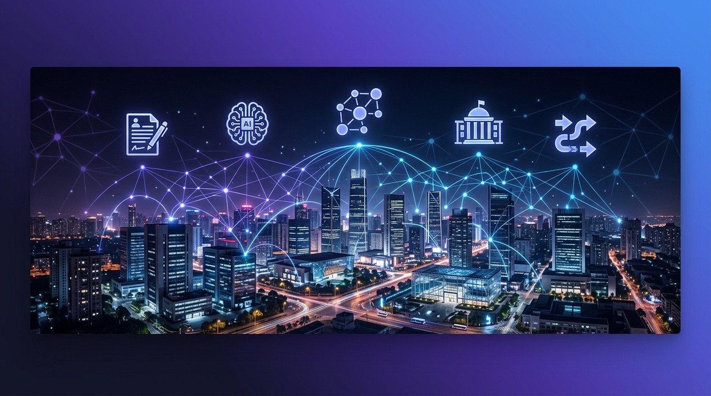
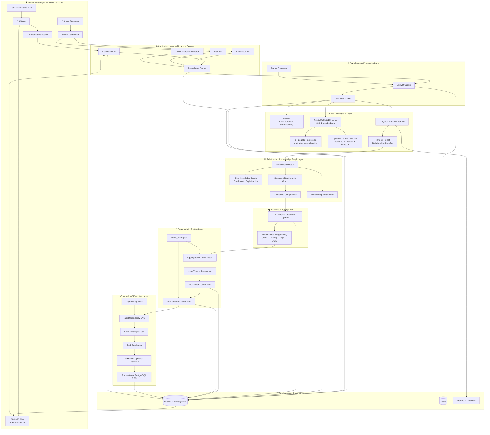
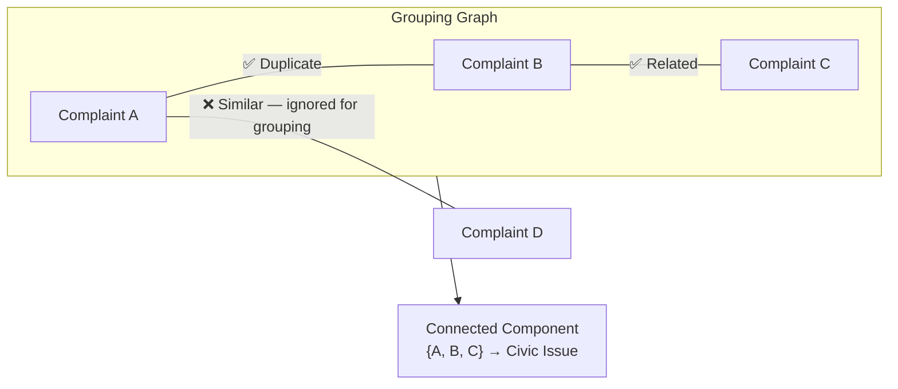
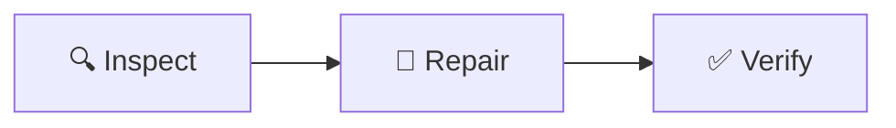
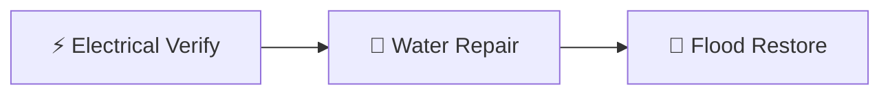

<div align="center">



<br/>

<h1 align="center" style="font-size: 3em; margin-top: 10px; font-weight: 800;">🏛️ GrievanceIQ</h1>

<p align="center" style="font-size: 1.2em; color: #667eea; font-weight: 500;">
  Transforming unstructured citizen complaints into structured Civic Issues,<br/>
  deterministic departmental workstreams, and dependency-aware municipal tasks.
</p>

<br/>

<!-- ANIMATED SHIELDS -->
<a href="https://github.com/Vishh70/grievanceiq/actions/workflows/backend-ci.yml">
  
</a>
<a href="https://github.com/Vishh70/grievanceiq/actions/workflows/frontend-ci.yml">
  
</a>
<a href="https://github.com/Vishh70/grievanceiq/commits/main">
  
</a>

<br/><br/>

<!-- TECH STACK SHIELDS -->


<br/>

<!-- ML SHIELDS -->


<br/>
<br/>

</div>

## 📑 Table of Contents

<details open>
<summary><b>Show / Hide Menu</b></summary>
<br/>

1. [🎯 The Problem](#-the-problem)
2. [💡 Why GrievanceIQ?](#-why-grievanceiq)
3. [🔭 System Overview](#-system-overview)
4. [🏗️ Architecture](#️-architecture)
   - [High-Level Architecture](#high-level-architecture)
   - [Complaint Processing Flow](#complaint-processing-flow)
   - [Relationship & Task Graphs](#complaint-relationship-graph)
5. [✨ Core Features](#-core-features)
6. [🧠 AI / ML Pipeline](#-ai--ml-pipeline)
7. [📊 Evaluation Results](#-evaluation-results)
8. [🚀 Quick Start](#-quick-start)
9. [🎓 Viva-Ready Reference](#-viva-ready-reference)

</details>

<br/>

---

## 🎯 The Problem

Citizen complaints to municipalities are historically **unstructured**, **duplicated**, **ambiguous**, **multi-issue**, and **geographically scattered**. This makes them incredibly hard to route manually.

GrievanceIQ solves this with an end-to-end intelligent pipeline:

<pre>
📝 Unstructured Complaint
  ↳ 🧠 Semantic Embedding <kbd>MiniLM-L6</kbd>
    ↳ 🏷️ Multi-Label Classification <kbd>9 issue types</kbd>
      ↳ 🔗 Relationship Detection <kbd>Random Forest</kbd>
        ↳ 🏘️ Civic Issue Grouping <kbd>Connected Components</kbd>
          ↳ 🏢 Department Routing <kbd>Deterministic Mapping</kbd>
            ↳ 📋 Task Generation <kbd>DAG + Kahn's Sort</kbd>
              ↳ ✅ Transactional Execution <kbd>PostgreSQL RPC</kbd>
</pre>

<div align="right"><a href="#-table-of-contents">⬆ Back to Top</a></div>

---

## 💡 Why GrievanceIQ?

<table>
  <thead>
    <tr>
      <th width="35%">Problem</th>
      <th width="65%">GrievanceIQ Approach</th>
    </tr>
  </thead>
  <tbody>
    <tr>
      <td>🔄 <b>Duplicate complaints</b></td>
      <td>Hybrid semantic + location + temporal duplicate detection</td>
    </tr>
    <tr>
      <td>🔗 <b>Related complaints</b></td>
      <td>ML relationship classifier + graph-based grouping</td>
    </tr>
    <tr>
      <td>🏷️ <b>Multiple issue types</b></td>
      <td>9-label multi-label classifier (<b>98.53% Micro F1</b>)</td>
    </tr>
    <tr>
      <td>🏢 <b>Unclear responsibility</b></td>
      <td>Deterministic <code>issue-type → department</code> mapping</td>
    </tr>
    <tr>
      <td>📊 <b>Operational sequencing</b></td>
      <td>Dependency DAG + Kahn's topological sort</td>
    </tr>
    <tr>
      <td>🔒 <b>Inconsistent states</b></td>
      <td>Transactional PostgreSQL task execution via RPC</td>
    </tr>
    <tr>
      <td>🧩 <b>Relationship explainability</b></td>
      <td>Knowledge Graph enrichment layer</td>
    </tr>
    <tr>
      <td>📎 <b>Data loss during merges</b></td>
      <td>Deterministic Civic Issue merge policy (Count → Priority → Age → UUID)</td>
    </tr>
  </tbody>
</table>

<div align="right"><a href="#-table-of-contents">⬆ Back to Top</a></div>

---

## 🔭 System Overview

GrievanceIQ is structured into **nine logical layers**:

<div align="center">
<table>
<tr>
<td width="50" align="center"><b>Layer</b></td>
<td><b>Component</b></td>
<td><b>Technology / Algorithm</b></td>
</tr>
<tr><td align="center">1</td><td><b>Presentation</b></td><td>React 19 + Vite + TypeScript</td></tr>
<tr><td align="center">2</td><td><b>Application</b></td><td>Node.js 22 + Express + JWT + Zod</td></tr>
<tr><td align="center">3</td><td><b>Async Processing</b></td><td>BullMQ + Redis</td></tr>
<tr><td align="center">4</td><td><b>AI / ML Intelligence</b></td><td>Gemini + MiniLM + Logistic Regression + Random Forest</td></tr>
<tr><td align="center">5</td><td><b>Relationship Graph</b></td><td>Graph Construction + Knowledge Enrichment</td></tr>
<tr><td align="center">6</td><td><b>Civic Issue Aggregation</b></td><td>Connected Components + Deterministic Merge Policy</td></tr>
<tr><td align="center">7</td><td><b>Deterministic Routing</b></td><td><code>routing_rules.json</code> + Department Mapping</td></tr>
<tr><td align="center">8</td><td><b>Workflow Execution</b></td><td>DAG + Kahn's Sort + Transactional RPC</td></tr>
<tr><td align="center">9</td><td><b>Infrastructure</b></td><td>Supabase PostgreSQL + Redis + Flask Artifacts</td></tr>
</table>
</div>

> [!NOTE]
> The system operates via **near-real-time 5-second polling** and **controlled human operator execution** — not real-time WebSockets or autonomous physical municipal dispatch.

<div align="right"><a href="#-table-of-contents">⬆ Back to Top</a></div>

---

## 🏗️ Architecture

### High-Level Architecture



### Complaint Relationship Graph

GrievanceIQ distinguishes between **relationship prediction** and **graph grouping**:



> [!IMPORTANT]
> The relationship classifier predicts `Duplicate`, `Similar`, `Related`, or `Independent`. For Civic Issue formation, **only `Duplicate` and `Related`** create graph edges. `Similar` is intentionally excluded to reduce false merges.

### Task Dependency Graph

<table>
<tr>
<td>

**Single-department pipeline:**


</td>
<td>

**Cross-department dependencies:**


</td>
</tr>
</table>

<div align="right"><a href="#-table-of-contents">⬆ Back to Top</a></div>

---

## ✨ Core Features

<details>
<summary><b>🧠 Intelligent Complaint Intake</b></summary>
<blockquote>
<p>Complaint persistence with full metadata, asynchronous BullMQ processing, and <code>PROCESSING → PROCESSED / FAILED</code> lifecycle management. Features Gemini-powered initial triage and near-real-time 5-second status polling.</p>
</blockquote>
</details>

<details>
<summary><b>🏷️ Multi-Label Issue Classification</b></summary>
<blockquote>
<p>Utilizes 9 independent Logistic Regression classifiers acting on 384-dimensional embeddings (<code>Xenova/all-MiniLM-L6-v2</code>). Resolves issues like Road damage, Water leakage, and Tree hazards simultaneously.</p>
</blockquote>
</details>

<details>
<summary><b>🔗 Relationship Classification & 🔍 Duplicate Detection</b></summary>
<blockquote>
<p>A scikit-learn Random Forest (10 trees) processes 20 structured features to predict <code>Duplicate</code>, <code>Similar</code>, <code>Related</code>, or <code>Independent</code>. Pre-filtered by a hybrid semantic + location + temporal duplicate detection heuristic.</p>
</blockquote>
</details>

<details>
<summary><b>🏘️ Civic Issue Aggregation & 🏢 Routing</b></summary>
<blockquote>
<p>Undirected graph traversal (Connected Components) merges complaints using a deterministic policy (Count → Priority → Age → UUID). Routing rules map aggregated ML labels directly to departmental workstreams.</p>
</blockquote>
</details>

<details>
<summary><b>📋 Workflow Task Execution</b></summary>
<blockquote>
<p>Dependency DAG processed via Kahn's topological sort ensures execution ordering. Task status transitions are strictly enforced via Transactional PostgreSQL RPC.</p>
</blockquote>
</details>

<div align="right"><a href="#-table-of-contents">⬆ Back to Top</a></div>

---

## 🧠 AI / ML Pipeline

GrievanceIQ utilizes **three distinct intelligence mechanisms** operating in concert:

<div align="center">

| 🤖 **Gemini API** | 🏷️ **Multi-Label Classifier** | 🔗 **Relationship Classifier** |
|:---:|:---:|:---:|
| **Initial Understanding** | **9 Issue Categories** | **Complaint Pairs** |
| External API call for complaint triage and initial categorization. | <code>Text → 384-dim Embedding → Logistic Regression ×9 → 9 Flags</code> | <code>A + B → 20 Structured Features → Random Forest → Dup/Sim/Rel/Ind</code> |

</div>

<br/>

### Relationship Feature Vector (20 Features)

<table>
<tr>
<td>

**6 Scalar Features**
1. `semantic_similarity`
2. `location_score`
3. `temporal_score`
4. `duplicate_score`
5. `duplicate_flag`
6. `same_category`

</td>
<td>

**7 Category Indicators (A)**
7–13. Category flags for Complaint A

</td>
<td>

**7 Category Indicators (B)**
14–20. Category flags for Complaint B

</td>
</tr>
</table>

<div align="right"><a href="#-table-of-contents">⬆ Back to Top</a></div>

---

## 📊 Evaluation Results

> [!CAUTION]
> All ML metrics are based on **synthetic held-out evaluation data** and must not be interpreted as real-world municipal accuracy.

<table>
<tr>
<td width="50%">

### 🔗 Relationship Classifier

| Metric | Value |
|:-------|------:|
| **Test Accuracy** | **93.30%** |
| Macro Precision | 86.86% |
| Macro Recall | 94.76% |
| **Macro F1** | **89.99%** |

| Config | Detail |
|:-------|:-------|
| Dataset | 16,000 → 10,555 usable pairs |
| Split | 8,818 / 901 / 836 |
| Features | 20 |
| Model | Random Forest (10 trees) |

</td>
<td width="50%">

### 🏷️ Multi-Label Classifier

| Metric | Value |
|:-------|------:|
| **Exact Match** | **95.00%** |
| Micro Precision | 97.86% |
| Micro Recall | 99.21% |
| **Micro F1** | **98.53%** |
| Macro F1 | 98.50% |

| Config | Detail |
|:-------|:-------|
| Labels | 9 |
| Embedding | 384 dimensions |
| Split | 4,196 / 904 / 900 |
| Model | 9 × Logistic Regression |

</td>
</tr>
</table>

<div align="right"><a href="#-table-of-contents">⬆ Back to Top</a></div>

---

## 🚀 Quick Start

### 1️⃣ Clone & Install

```bash
git clone https://github.com/Vishh70/grievanceiq.git
cd grievanceiq

npm ci --prefix backend
npm ci --prefix frontend
pip install -r backend/ml/requirements.txt
```

### 2️⃣ Configure Environment

Create `backend/.env`:

```env
SUPABASE_URL=your_supabase_url
SUPABASE_ANON_KEY=your_supabase_anon_key
GEMINI_API_KEY=your_gemini_api_key
ML_SERVICE_URL=http://localhost:5001
NODE_ENV=development
```

### 3️⃣ Start Services

Start all three local services in separate terminal instances:

```bash
python backend/ml/inference/grievanceiq_inference.py  # Terminal 1: Port 5001
npm run dev --prefix backend                          # Terminal 2: Port 5000
npm run dev --prefix frontend                         # Terminal 3: Port 5173
```

<div align="right"><a href="#-table-of-contents">⬆ Back to Top</a></div>

---

## 🎓 Viva-Ready Reference

<details>
<summary><b>📚 Click to expand full technical Q&A</b></summary>

| Question | Answer |
|:---------|:-------|
| Primary embedding model? | `Xenova/all-MiniLM-L6-v2`, 384 dimensions |
| Issue classifier? | 9-label multi-label Logistic Regression classifier |
| Relationship classifier? | scikit-learn Random Forest (10 trees), served by Flask |
| Relationship classes? | Duplicate · Similar · Related · Independent |
| Relationship features? | 20 (6 scalar + 7 category_A + 7 category_B) |
| Relationship test accuracy? | 93.30% on 836 held-out pairs |
| Relationship macro F1? | 89.99% |
| Multi-label test Micro F1? | 98.53% on 900 held-out records |
| How are complaints grouped? | Complaint relationship graph → Connected Components |
| Which edges create groups? | Only `Duplicate` and `Related` — NOT `Similar` |
| How is routing done? | Deterministic `issue-type → department` mapping via `routing_rules.json` |
| Task planning algorithm? | DAG + Kahn's topological sort with cycle detection |
| How is execution consistency ensured? | Transactional Supabase/PostgreSQL RPC |
| What dataset was used? | Synthetic prototype dataset |
| What prevents duplicate Civic Issues? | Deterministic merge policy: count → priority → age → UUID |
| Frontend framework? | React 19 + Vite + TypeScript |
| What queue system? | BullMQ backed by Redis |
| How does the frontend get status? | 5-second polling on `GET /api/complaints/:id/status` |
| What does Gemini do? | Initial complaint understanding — NOT the trained classifier |
| What is the Knowledge Graph? | Enrichment/explainability — NOT the primary relationship classifier |

</details>

<div align="right"><a href="#-table-of-contents">⬆ Back to Top</a></div>

---

## 📜 Research Disclosure

> [!IMPORTANT]
> GrievanceIQ is a **prototype/academic civic intelligence system**. Model results are based on synthetic datasets and controlled evaluation scenarios. They demonstrate the implemented pipeline and experimental performance — not guaranteed real-world municipal deployment performance.

---

<div align="center">


</div>
